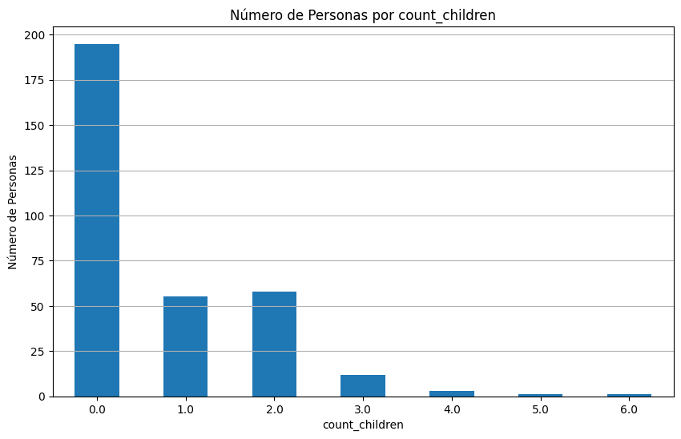

```python
import pandas as pd
import os
import matplotlib.pyplot as plt
import seaborn as sns
import pyarrow.parquet as pq
```


```python
local_directory = "/mnt/d/zrive-ds/src/module_2/files_downloaded"
```


```python
import sys
print(sys.executable)
```

    /mnt/d/zrive-ds/.venv/bin/python


```python
def load_data(list_of_files):
    dataframes = []
    
    for file in list_of_files:
        file_path = os.path.join(local_directory, file)

        if not os.path.exists(file_path):
            print(f"File not found: {file_path}")
            continue

        try:
            if file.endswith(".parquet"):
                print(f"Loading Parquet file: {file}")
                df = pd.read_parquet(file_path)
            elif file.endswith(".csv"):
                print(f"Loading CSV file: {file}")
                df = pd.read_csv(file_path)
            else:
                print(f"Unsupported file format: {file}")
                continue

            dataframes.append(df)
            print(f"Successfully loaded {file} with {df.shape[0]} rows and {df.shape[1]} columns.")

        except Exception as e:
            print(f"Error loading {file}: {e}")

    return dataframes
```


```python
orders = load_data(["orders.parquet"])[0]
```

    Loading Parquet file: orders.parquet
    Successfully loaded orders.parquet with 8773 rows and 6 columns.


```python
orders.info()
orders.head(10)
```

    <class 'pandas.core.frame.DataFrame'>
    Index: 8773 entries, 10 to 64538
    Data columns (total 6 columns):
     #   Column          Non-Null Count  Dtype         
    ---  ------          --------------  -----         
     0   id              8773 non-null   int64         
     1   user_id         8773 non-null   object        
     2   created_at      8773 non-null   datetime64[us]
     3   order_date      8773 non-null   datetime64[us]
     4   user_order_seq  8773 non-null   int64         
     5   ordered_items   8773 non-null   object        
    dtypes: datetime64[us](2), int64(2), object(2)
    memory usage: 479.8+ KB


<div>
<style scoped>
    .dataframe tbody tr th:only-of-type {
        vertical-align: middle;
    }

    .dataframe tbody tr th {
        vertical-align: top;
    }

    .dataframe thead th {
        text-align: right;
    }
</style>
<table border="1" class="dataframe">
  <thead>
    <tr style="text-align: right;">
      <th></th>
      <th>id</th>
      <th>user_id</th>
      <th>created_at</th>
      <th>order_date</th>
      <th>user_order_seq</th>
      <th>ordered_items</th>
    </tr>
  </thead>
  <tbody>
    <tr>
      <th>10</th>
      <td>2204073066628</td>
      <td>62e271062eb827e411bd73941178d29b022f5f2de9d37f...</td>
      <td>2020-04-30 14:32:19</td>
      <td>2020-04-30</td>
      <td>1</td>
      <td>[33618849693828, 33618860179588, 3361887404045...</td>
    </tr>
    <tr>
      <th>20</th>
      <td>2204707520644</td>
      <td>bf591c887c46d5d3513142b6a855dd7ffb9cc00697f6f5...</td>
      <td>2020-04-30 17:39:00</td>
      <td>2020-04-30</td>
      <td>1</td>
      <td>[33618835243140, 33618835964036, 3361886244058...</td>
    </tr>
    <tr>
      <th>21</th>
      <td>2204838822020</td>
      <td>329f08c66abb51f8c0b8a9526670da2d94c0c6eef06700...</td>
      <td>2020-04-30 18:12:30</td>
      <td>2020-04-30</td>
      <td>1</td>
      <td>[33618891145348, 33618893570180, 3361889766618...</td>
    </tr>
    <tr>
      <th>34</th>
      <td>2208967852164</td>
      <td>f6451fce7b1c58d0effbe37fcb4e67b718193562766470...</td>
      <td>2020-05-01 19:44:11</td>
      <td>2020-05-01</td>
      <td>1</td>
      <td>[33618830196868, 33618846580868, 3361891234624...</td>
    </tr>
    <tr>
      <th>49</th>
      <td>2215889436804</td>
      <td>68e872ff888303bff58ec56a3a986f77ddebdbe5c279e7...</td>
      <td>2020-05-03 21:56:14</td>
      <td>2020-05-03</td>
      <td>1</td>
      <td>[33667166699652, 33667166699652, 3366717122163...</td>
    </tr>
    <tr>
      <th>51</th>
      <td>2217346236548</td>
      <td>66a7b6a77952abc3ef3246da56fb148814704a3c2b420c...</td>
      <td>2020-05-04 11:25:26</td>
      <td>2020-05-04</td>
      <td>1</td>
      <td>[33667168796804, 33667178594436, 3366720605402...</td>
    </tr>
    <tr>
      <th>53</th>
      <td>2219446730884</td>
      <td>7ce6569d75a8bc75b72516e059edecb0bc2245750bfa68...</td>
      <td>2020-05-04 23:57:21</td>
      <td>2020-05-04</td>
      <td>1</td>
      <td>[33667178594436, 33667184492676, 3366721657254...</td>
    </tr>
    <tr>
      <th>61</th>
      <td>2222574076036</td>
      <td>f4f0753d9919c6d39afc6b1d797a34e31224698d5d92a5...</td>
      <td>2020-05-05 21:09:55</td>
      <td>2020-05-05</td>
      <td>1</td>
      <td>[33667168829572, 33667195437188, 3366721860416...</td>
    </tr>
    <tr>
      <th>68</th>
      <td>2224066986116</td>
      <td>aed88fc0b004270a62ff1fe4b94141f6b1db1496dbb0c0...</td>
      <td>2020-05-06 10:23:11</td>
      <td>2020-05-06</td>
      <td>1</td>
      <td>[33667171221636, 33667177382020, 3366717856166...</td>
    </tr>
    <tr>
      <th>70</th>
      <td>2224765862020</td>
      <td>4594e99557113d5a1c5b59bf31b8704aafe5c7bd180b32...</td>
      <td>2020-05-06 16:03:35</td>
      <td>2020-05-06</td>
      <td>1</td>
      <td>[33667174695044, 33667203596420, 3366720589018...</td>
    </tr>
  </tbody>
</table>
</div>


```python
orders.describe()["user_order_seq"]
```


    count    8773.000000
    mean        2.445116
    min         1.000000
    25%         1.000000
    50%         1.000000
    75%         3.000000
    max        25.000000
    std         2.707693
    Name: user_order_seq, dtype: float64


```python
orders["order_date"].min()
```


    Timestamp('2020-04-30 00:00:00')


```python
orders["order_date"].max()
```


    Timestamp('2022-03-14 00:00:00')


```python
orders["user_order_seq"].value_counts()
```


    user_order_seq
    1     4983
    2     1411
    3      713
    4      462
    5      314
    6      225
    7      167
    8      121
    9       89
    10      66
    11      51
    12      38
    13      31
    14      25
    15      15
    16      14
    17      12
    18       9
    19       8
    20       7
    21       6
    22       3
    23       1
    24       1
    25       1
    Name: count, dtype: int64


```python
orders['list_length'] = orders['ordered_items'].apply(len)
length_count_orders = orders['list_length'].value_counts().sort_index()
length_count_orders
```


    list_length
    1        6
    2       54
    3       82
    4      349
    5      510
          ... 
    67       2
    68       1
    70       1
    71       1
    114      1
    Name: count, Length: 63, dtype: int64


```python
plt.figure(figsize=(10, 6))
plt.bar(length_count_orders.index, length_count_orders.values, color='skyblue')
plt.xlabel('Longitud de las listas')
plt.ylabel('Número de órdenes')
plt.title('Número de órdenes por longitud de listas')
plt.grid(axis='x')
plt.grid(axis='y')

plt.show()
```


    

    


```python
product_count_orders = {}
for list_of_order in orders['ordered_items']:
    for num in list_of_order:
        if num in product_count_orders:
            product_count_orders[num] += 1
        else:
            product_count_orders[num] = 1
            
sorted_products = sorted(product_count_orders.items(), key=lambda x: x[1], reverse=True) 
top_5_products = sorted_products[:5]

top_5_products
```


    [(34081589887108, 4487),
     (39284117930116, 2658),
     (34137590366340, 1459),
     (34081331970180, 1170),
     (34284951863428, 1133)]


```python

total_items_ordered = (length_count_orders*length_count_orders.index).sum()
total_items_ordered
```


    107958


```python
def calculate_relative_weight(sorted_products, total_items_ordered, top_n):
    '''
    Returns the percentage of products ordered coming from the top n products sold.
    '''
    top_n_products = sorted_products[:top_n]
    top_n_sum = sum([count for product, count in top_n_products])
    return (top_n_sum / total_items_ordered) * 100


```


```python
top_5_sum = calculate_relative_weight(sorted_products, total_items_ordered, 5)
top_10_sum = calculate_relative_weight(sorted_products, total_items_ordered, 10)
top_20_sum = calculate_relative_weight(sorted_products, total_items_ordered, 20)

print("\nPeso relativo de los top productos (en porcentaje):")
print("Top 5 products:", top_5_sum)
print("Top 10 products:", top_10_sum)
print("Top 20 products:", top_20_sum)
```

    
    Peso relativo de los top productos (en porcentaje):
    Top 5 products: 10.103003019692844
    Top 10 products: 14.084180885159043
    Top 20 products: 19.46405083458382


```python
orders['order_date'] = pd.to_datetime(orders['order_date'])

orders['year_month'] = orders['order_date'].dt.to_period('M')

monthly_count_orders = orders['year_month'].value_counts().sort_index()
monthly_count_orders
```


    year_month
    2020-04       3
    2020-05      25
    2020-06      42
    2020-07      58
    2020-08      66
    2020-09      96
    2020-10     123
    2020-11     152
    2020-12     175
    2021-01     390
    2021-02     374
    2021-03     397
    2021-04     391
    2021-05     408
    2021-06     412
    2021-07     335
    2021-08     345
    2021-09     359
    2021-10     754
    2021-11     903
    2021-12     716
    2022-01    1080
    2022-02     891
    2022-03     278
    Freq: M, Name: count, dtype: int64


```python
regulars = load_data(["regulars.parquet"])[0]
```

    Loading Parquet file: regulars.parquet
    Successfully loaded regulars.parquet with 18105 rows and 3 columns.


```python
regulars.info()
regulars.head(10)
```

    <class 'pandas.core.frame.DataFrame'>
    Index: 18105 entries, 3 to 37720
    Data columns (total 3 columns):
     #   Column      Non-Null Count  Dtype         
    ---  ------      --------------  -----         
     0   user_id     18105 non-null  object        
     1   variant_id  18105 non-null  int64         
     2   created_at  18105 non-null  datetime64[us]
    dtypes: datetime64[us](1), int64(1), object(1)
    memory usage: 565.8+ KB


<div>
<style scoped>
    .dataframe tbody tr th:only-of-type {
        vertical-align: middle;
    }

    .dataframe tbody tr th {
        vertical-align: top;
    }

    .dataframe thead th {
        text-align: right;
    }
</style>
<table border="1" class="dataframe">
  <thead>
    <tr style="text-align: right;">
      <th></th>
      <th>user_id</th>
      <th>variant_id</th>
      <th>created_at</th>
    </tr>
  </thead>
  <tbody>
    <tr>
      <th>3</th>
      <td>68e872ff888303bff58ec56a3a986f77ddebdbe5c279e7...</td>
      <td>33618848088196</td>
      <td>2020-04-30 15:07:03</td>
    </tr>
    <tr>
      <th>11</th>
      <td>aed88fc0b004270a62ff1fe4b94141f6b1db1496dbb0c0...</td>
      <td>33667178659972</td>
      <td>2020-05-05 23:34:35</td>
    </tr>
    <tr>
      <th>18</th>
      <td>68e872ff888303bff58ec56a3a986f77ddebdbe5c279e7...</td>
      <td>33619009208452</td>
      <td>2020-04-30 15:07:03</td>
    </tr>
    <tr>
      <th>46</th>
      <td>aed88fc0b004270a62ff1fe4b94141f6b1db1496dbb0c0...</td>
      <td>33667305373828</td>
      <td>2020-05-05 23:34:35</td>
    </tr>
    <tr>
      <th>47</th>
      <td>4594e99557113d5a1c5b59bf31b8704aafe5c7bd180b32...</td>
      <td>33667247341700</td>
      <td>2020-05-06 14:42:11</td>
    </tr>
    <tr>
      <th>48</th>
      <td>62e271062eb827e411bd73941178d29b022f5f2de9d37f...</td>
      <td>33618909495428</td>
      <td>2020-04-30 13:09:27</td>
    </tr>
    <tr>
      <th>50</th>
      <td>68e872ff888303bff58ec56a3a986f77ddebdbe5c279e7...</td>
      <td>33618991415428</td>
      <td>2020-04-30 15:07:03</td>
    </tr>
    <tr>
      <th>51</th>
      <td>329f08c66abb51f8c0b8a9526670da2d94c0c6eef06700...</td>
      <td>33618998853764</td>
      <td>2020-04-30 17:06:48</td>
    </tr>
    <tr>
      <th>87</th>
      <td>4594e99557113d5a1c5b59bf31b8704aafe5c7bd180b32...</td>
      <td>33667182493828</td>
      <td>2020-05-06 14:42:11</td>
    </tr>
    <tr>
      <th>107</th>
      <td>329f08c66abb51f8c0b8a9526670da2d94c0c6eef06700...</td>
      <td>33618846580868</td>
      <td>2020-04-30 17:06:48</td>
    </tr>
  </tbody>
</table>
</div>


```python
regulars["created_at"].min()
```


    Timestamp('2020-04-30 13:09:27')


```python
regulars["created_at"].max()
```


    Timestamp('2022-03-14 07:49:24')


```python
regulars['created_at'] = pd.to_datetime(regulars['created_at'])

regulars['year_month'] = regulars['created_at'].dt.to_period('M')

monthly_count_regulars = regulars['year_month'].value_counts().sort_index()
monthly_count_regulars
```


    year_month
    2020-04      61
    2020-05     147
    2020-06     167
    2020-07     358
    2020-08     194
    2020-09     135
    2020-10     317
    2020-11     419
    2020-12     324
    2021-01     957
    2021-02     716
    2021-03    1042
    2021-04     586
    2021-05     497
    2021-06     518
    2021-07     518
    2021-08     721
    2021-09     863
    2021-10    1001
    2021-11    1590
    2021-12    1423
    2022-01    2682
    2022-02    1842
    2022-03    1027
    Freq: M, Name: count, dtype: int64


```python
product_count_regulars = {}
for elem in regulars['variant_id']:
        if elem in product_count_regulars:
            product_count_regulars[elem] += 1
        else:
            product_count_regulars[elem] = 1
            
sorted_products_regulars = sorted(product_count_regulars.items(), key=lambda x: x[1], reverse=True) 
top_15_products_regulars = sorted_products_regulars[:15]

top_15_products_regulars
```


    [(34081589887108, 253),
     (34370361229444, 127),
     (33973249081476, 114),
     (34370915041412, 112),
     (34284951863428, 105),
     (33667282436228, 101),
     (34284949766276, 96),
     (34284950356100, 94),
     (34037939372164, 89),
     (34436055302276, 85),
     (34284951273604, 80),
     (33667302555780, 78),
     (33973246853252, 77),
     (33667247407236, 74),
     (33667207266436, 69)]


```python
total_regulars = len(regulars.index)

top_5_sum_regulars = calculate_relative_weight(sorted_products_regulars, total_regulars, 5)
top_10_sum_regulars = calculate_relative_weight(sorted_products_regulars, total_regulars, 10)
top_20_sum_regulars = calculate_relative_weight(sorted_products_regulars, total_regulars, 20)

print("\nPeso relativo de los top regulars (en porcentaje):")
print("Top 5 regulars:", top_5_sum_regulars)
print("Top 10 regulars:", top_10_sum_regulars)
print("Top 20 regulars:", top_20_sum_regulars)
```

    
    Peso relativo de los top regulars (en porcentaje):
    Top 5 regulars: 3.927091963545982
    Top 10 regulars: 6.495443247721624
    Top 20 regulars: 10.383871858602596


```python
regulars["user_id"].value_counts()[:10]
```


    user_id
    a124c8bb0453ea0957405b7a08a7fd377247bac054a097e7c081463f5f3f9dc641ce4caecaabfa32a16a758564b915a7e2d9827a2d2b06f08377b53fd2f536db    726
    ba068a3398230c10a98868ced1fcc5b889b21e6f112fd02f33de803a8889a6f0f0df38680ca3389322bc9594f4d09454ce9b13378796b1a5040d03d3c1292171    499
    9b5b3679033da9e1f3a4def18667e40a7763d0d3ec9d8fb50cf1d98ed5f5ef30e2c64a66774b69d8d4582f581ad07061c83323cf507276f9e760f2987cecee31    405
    257be7ae940425880bbb20bf162c2616b32881bf0a8bda4e4ce7f5ce0356c29b06e032dd593030a460d20c71353737305e51431a7df58ea0284c67c95084a42b    389
    9a4b53affbe91ca5fd0c97f6d86e8a59ae894f3c7a69a830a400911d45ae40f5bffeeeabc80e7a28bd8a28bab9b19fe5338811e80cbc12b8f48cf58458d3af6a    372
    0af18ff445827d3b373d87754ed90db1fe4924525d552b9369d31ad26e2726a9780e6aa4b17ed573851fa8fa8bd23d2636d8c0ba478c016db03820e9ba201a98    348
    4481102740bca52c40ca264bf88c39f0bc7d1f461b06291d06a58063e24815711ed4cd21f37acf601d20977e3ba5891c0c5e2b061534c5f9a86d458cb22b268c    313
    46470d0d117e4b2740ad9bf2bbb54b8231212d08adfb6492815d71d0d390e27b450e1fce28b9ca318a6242d52a1de99b2ea9836475175fed71b947ef3ae657ab    287
    51bc89eb83c0d3c049f45d4935207f2d39e80b029315217af066a5981830c75b9a6182b558e96b52a3232fcff07d6d675363cd8336b2f57d67ccbfcae3ff43f8    152
    8a29b9a2fd8feb4a5fe79d8ac63473ac6a7eee66469eec72eb93d216c5869e54f5a9f2c36f73cb58e86230ec0223bfb4c4602a3ba9908136f77eb85671343029    148
    Name: count, dtype: int64


```python
regulars.groupby('user_id')['variant_id'].nunique().sort_values(ascending=False)
```


    user_id
    9a4b53affbe91ca5fd0c97f6d86e8a59ae894f3c7a69a830a400911d45ae40f5bffeeeabc80e7a28bd8a28bab9b19fe5338811e80cbc12b8f48cf58458d3af6a    320
    9b5b3679033da9e1f3a4def18667e40a7763d0d3ec9d8fb50cf1d98ed5f5ef30e2c64a66774b69d8d4582f581ad07061c83323cf507276f9e760f2987cecee31    110
    11c967ad95d1e3a8f9767612e2f084aad75832cf019f8a232279b0f3b15388ee906988eea6ecee027ef43a5acb69b6c9290cc8ff5a322853c8734cfc3b719a55     90
    af86901cbe9be971840f20e73e8af9d733f0887163f331993e2dafed0d95fe557af64651845a1df0a0c4dca1dae5f611ed2c18d0f92a88f2c9277ae5da7986cb     88
    27c2c38327ba83867c6291ee6bd0c35548edd256ed51c9e1a530e15343ab53424ef69712a0ad5cb454a841e168102a6334bb3fa24153a27d7451c771decfdd8e     85
                                                                                                                                       ... 
    86bb9be63edb2553497ed881b31412a6698571f61e9020b3103ee393f518d18e39c44b0a53b22b606a686be7b0d7dad94db824cc53d7d963b0f038be68df0f9a      1
    86c2b1abd0ee950ab2f69638e0675fa38687f3fe734ccd5babb554e16a7dc1879f9f77b6699720e510fb7e897b9f2bd8e5ac6b3f186dd22ae8b51cb9b78011a3      1
    86c8d2a4d01c2dcfcb14718e39d829a82f2f2ff345119cea741bcb806646e79938cfac3374d2dea2e8b964d990e88f2a060e541dd8c70a74ecf4748b1b71b058      1
    86dda9069cd02cac4cfcc01e798e19414f7781e7ad28a2adfcccdb30e9a9612da89b5062a760abb4c507681fd811ee5d9aeb2a6f73221dc8fbbd824bc11c65ec      1
    8387474ae055ad5fa94b98ea7afb5ee32e1a5d300c15483a72be0adbbbd1b4ae2c94c2c87aef3f0e647955e8db152fd1472710e5c99e3ccc2abe26cfd56151c3      1
    Name: variant_id, Length: 1448, dtype: int64


```python
abandoned_carts = load_data(["abandoned_carts.parquet"])[0]
```

    Loading Parquet file: abandoned_carts.parquet
    Successfully loaded abandoned_carts.parquet with 5457 rows and 4 columns.


```python
abandoned_carts.info()
abandoned_carts.head()
```

    <class 'pandas.core.frame.DataFrame'>
    Index: 5457 entries, 0 to 70050
    Data columns (total 4 columns):
     #   Column      Non-Null Count  Dtype         
    ---  ------      --------------  -----         
     0   id          5457 non-null   int64         
     1   user_id     5457 non-null   object        
     2   created_at  5457 non-null   datetime64[us]
     3   variant_id  5457 non-null   object        
    dtypes: datetime64[us](1), int64(1), object(2)
    memory usage: 213.2+ KB


<div>
<style scoped>
    .dataframe tbody tr th:only-of-type {
        vertical-align: middle;
    }

    .dataframe tbody tr th {
        vertical-align: top;
    }

    .dataframe thead th {
        text-align: right;
    }
</style>
<table border="1" class="dataframe">
  <thead>
    <tr style="text-align: right;">
      <th></th>
      <th>id</th>
      <th>user_id</th>
      <th>created_at</th>
      <th>variant_id</th>
    </tr>
  </thead>
  <tbody>
    <tr>
      <th>0</th>
      <td>12858560217220</td>
      <td>5c4e5953f13ddc3bc9659a3453356155e5efe4739d7a2b...</td>
      <td>2020-05-20 13:53:24</td>
      <td>[33826459287684, 33826457616516, 3366719212762...</td>
    </tr>
    <tr>
      <th>13</th>
      <td>20352449839236</td>
      <td>9d6187545c005d39e44d0456d87790db18611d7c7379bd...</td>
      <td>2021-06-27 05:24:13</td>
      <td>[34415988179076, 34037940158596, 3450282236326...</td>
    </tr>
    <tr>
      <th>45</th>
      <td>20478401413252</td>
      <td>e83fb0273d70c37a2968fee107113698fd4f389c442c0b...</td>
      <td>2021-07-18 08:23:49</td>
      <td>[34543001337988, 34037939372164, 3411360609088...</td>
    </tr>
    <tr>
      <th>50</th>
      <td>20481783103620</td>
      <td>10c42e10e530284b7c7c50f3a23a98726d5747b8128084...</td>
      <td>2021-07-18 21:29:36</td>
      <td>[33667268116612, 34037940224132, 3443605520397...</td>
    </tr>
    <tr>
      <th>52</th>
      <td>20485321687172</td>
      <td>d9989439524b3f6fc4f41686d043f315fb408b954d6153...</td>
      <td>2021-07-19 12:17:05</td>
      <td>[33667268083844, 34284950454404, 33973246886020]</td>
    </tr>
  </tbody>
</table>
</div>


```python
abandoned_carts["created_at"].min()
```


    Timestamp('2020-05-20 13:53:24')


```python
abandoned_carts["created_at"].max()
```


    Timestamp('2022-03-13 14:12:10')


```python
abandoned_carts['created_at'] = pd.to_datetime(abandoned_carts['created_at'])

abandoned_carts['year_month'] = abandoned_carts['created_at'].dt.to_period('M')

monthly_count_abandoned_carts = abandoned_carts['year_month'].value_counts().sort_index()
monthly_count_abandoned_carts
```


    year_month
    2020-05       1
    2021-06       1
    2021-07      25
    2021-08     135
    2021-09     248
    2021-10     560
    2021-11     988
    2021-12     871
    2022-01    1318
    2022-02     989
    2022-03     321
    Freq: M, Name: count, dtype: int64


```python
abandoned_carts['list_length'] = abandoned_carts['variant_id'].apply(len)
length_count_abandoned_carts = abandoned_carts['list_length'].value_counts().sort_index()
length_count_abandoned_carts
```


    list_length
    1     814
    2     895
    3     611
    4     533
    5     427
    6     383
    7     322
    8     247
    9     223
    10    211
    11    166
    12    161
    13    105
    14     79
    15     54
    16     56
    17     34
    18     30
    19     25
    20     13
    21     15
    22      7
    23      9
    24     11
    25      3
    26      2
    27      3
    28      4
    29      3
    30      1
    31      2
    33      3
    36      1
    38      2
    40      1
    42      1
    Name: count, dtype: int64


```python
exploded_df_abandoned_carts = abandoned_carts.explode('variant_id')

variant_counts_abandoned_carts = exploded_df_abandoned_carts['variant_id'].value_counts().reset_index()

variant_counts_abandoned_carts[:10]
```


<div>
<style scoped>
    .dataframe tbody tr th:only-of-type {
        vertical-align: middle;
    }

    .dataframe tbody tr th {
        vertical-align: top;
    }

    .dataframe thead th {
        text-align: right;
    }
</style>
<table border="1" class="dataframe">
  <thead>
    <tr style="text-align: right;">
      <th></th>
      <th>variant_id</th>
      <th>count</th>
    </tr>
  </thead>
  <tbody>
    <tr>
      <th>0</th>
      <td>34081589887108</td>
      <td>608</td>
    </tr>
    <tr>
      <th>1</th>
      <td>34284951863428</td>
      <td>478</td>
    </tr>
    <tr>
      <th>2</th>
      <td>34284950356100</td>
      <td>409</td>
    </tr>
    <tr>
      <th>3</th>
      <td>34137590366340</td>
      <td>395</td>
    </tr>
    <tr>
      <th>4</th>
      <td>34284949766276</td>
      <td>382</td>
    </tr>
    <tr>
      <th>5</th>
      <td>34284950519940</td>
      <td>307</td>
    </tr>
    <tr>
      <th>6</th>
      <td>34284950454404</td>
      <td>306</td>
    </tr>
    <tr>
      <th>7</th>
      <td>39459279929476</td>
      <td>305</td>
    </tr>
    <tr>
      <th>8</th>
      <td>39284117930116</td>
      <td>298</td>
    </tr>
    <tr>
      <th>9</th>
      <td>34037939372164</td>
      <td>290</td>
    </tr>
  </tbody>
</table>
</div>


```python
inventory = load_data(["inventory.parquet"])[0]
```

    Loading Parquet file: inventory.parquet
    Successfully loaded inventory.parquet with 1733 rows and 6 columns.


```python
inventory.info()
inventory.head()
```

    <class 'pandas.core.frame.DataFrame'>
    RangeIndex: 1733 entries, 0 to 1732
    Data columns (total 6 columns):
     #   Column            Non-Null Count  Dtype  
    ---  ------            --------------  -----  
     0   variant_id        1733 non-null   int64  
     1   price             1733 non-null   float64
     2   compare_at_price  1733 non-null   float64
     3   vendor            1733 non-null   object 
     4   product_type      1733 non-null   object 
     5   tags              1733 non-null   object 
    dtypes: float64(2), int64(1), object(3)
    memory usage: 81.4+ KB


<div>
<style scoped>
    .dataframe tbody tr th:only-of-type {
        vertical-align: middle;
    }

    .dataframe tbody tr th {
        vertical-align: top;
    }

    .dataframe thead th {
        text-align: right;
    }
</style>
<table border="1" class="dataframe">
  <thead>
    <tr style="text-align: right;">
      <th></th>
      <th>variant_id</th>
      <th>price</th>
      <th>compare_at_price</th>
      <th>vendor</th>
      <th>product_type</th>
      <th>tags</th>
    </tr>
  </thead>
  <tbody>
    <tr>
      <th>0</th>
      <td>39587297165444</td>
      <td>3.09</td>
      <td>3.15</td>
      <td>heinz</td>
      <td>condiments-dressings</td>
      <td>[table-sauces, vegan]</td>
    </tr>
    <tr>
      <th>1</th>
      <td>34370361229444</td>
      <td>4.99</td>
      <td>5.50</td>
      <td>whogivesacrap</td>
      <td>toilet-roll-kitchen-roll-tissue</td>
      <td>[b-corp, eco, toilet-rolls]</td>
    </tr>
    <tr>
      <th>2</th>
      <td>34284951863428</td>
      <td>3.69</td>
      <td>3.99</td>
      <td>plenty</td>
      <td>toilet-roll-kitchen-roll-tissue</td>
      <td>[kitchen-roll]</td>
    </tr>
    <tr>
      <th>3</th>
      <td>33667283583108</td>
      <td>1.79</td>
      <td>1.99</td>
      <td>thecheekypanda</td>
      <td>toilet-roll-kitchen-roll-tissue</td>
      <td>[b-corp, cruelty-free, eco, tissue, vegan]</td>
    </tr>
    <tr>
      <th>4</th>
      <td>33803537973380</td>
      <td>1.99</td>
      <td>2.09</td>
      <td>colgate</td>
      <td>dental</td>
      <td>[dental-accessories]</td>
    </tr>
  </tbody>
</table>
</div>


```python
inventory["price"].describe()
```


    count    1733.000000
    mean        6.307351
    std         7.107218
    min         0.000000
    25%         2.490000
    50%         3.990000
    75%         7.490000
    max        59.990000
    Name: price, dtype: float64


```python
inventory["compare_at_price"].describe()
```


    count    1733.000000
    mean        7.028881
    std         7.660542
    min         0.000000
    25%         2.850000
    50%         4.490000
    75%         8.210000
    max        60.000000
    Name: compare_at_price, dtype: float64


```python
no_price_info_products_inventory = inventory[inventory['price'] == 0]

no_price_info_products_inventory
```


<div>
<style scoped>
    .dataframe tbody tr th:only-of-type {
        vertical-align: middle;
    }

    .dataframe tbody tr th {
        vertical-align: top;
    }

    .dataframe thead th {
        text-align: right;
    }
</style>
<table border="1" class="dataframe">
  <thead>
    <tr style="text-align: right;">
      <th></th>
      <th>variant_id</th>
      <th>price</th>
      <th>compare_at_price</th>
      <th>vendor</th>
      <th>product_type</th>
      <th>tags</th>
    </tr>
  </thead>
  <tbody>
    <tr>
      <th>95</th>
      <td>40070658490500</td>
      <td>0.0</td>
      <td>0.0</td>
      <td>jordans</td>
      <td>cereal</td>
      <td>[cereal-bars]</td>
    </tr>
    <tr>
      <th>96</th>
      <td>40167931674756</td>
      <td>0.0</td>
      <td>0.0</td>
      <td>whogivesacrap</td>
      <td></td>
      <td>[]</td>
    </tr>
    <tr>
      <th>97</th>
      <td>40167931707524</td>
      <td>0.0</td>
      <td>0.0</td>
      <td>whogivesacrap</td>
      <td></td>
      <td>[]</td>
    </tr>
    <tr>
      <th>99</th>
      <td>40070656786564</td>
      <td>0.0</td>
      <td>0.0</td>
      <td>mcvities</td>
      <td>biscuits-crackers</td>
      <td>[biscuits, pm]</td>
    </tr>
    <tr>
      <th>100</th>
      <td>40070657933444</td>
      <td>0.0</td>
      <td>0.0</td>
      <td>astonish</td>
      <td>cleaning-products</td>
      <td>[bathroom-limescale-cleaner]</td>
    </tr>
    <tr>
      <th>...</th>
      <td>...</td>
      <td>...</td>
      <td>...</td>
      <td>...</td>
      <td>...</td>
      <td>...</td>
    </tr>
    <tr>
      <th>1554</th>
      <td>40070660292740</td>
      <td>0.0</td>
      <td>0.0</td>
      <td>biona</td>
      <td>biscuits-crackers</td>
      <td>[crackers]</td>
    </tr>
    <tr>
      <th>1575</th>
      <td>40070658654340</td>
      <td>0.0</td>
      <td>0.0</td>
      <td>lovecorn</td>
      <td>snacks-confectionery</td>
      <td>[savoury-snacks]</td>
    </tr>
    <tr>
      <th>1623</th>
      <td>40070660587652</td>
      <td>0.0</td>
      <td>0.0</td>
      <td>snackajack</td>
      <td>biscuits-crackers</td>
      <td>[crackers]</td>
    </tr>
    <tr>
      <th>1627</th>
      <td>40070660489348</td>
      <td>0.0</td>
      <td>0.0</td>
      <td>garnier</td>
      <td>skincare</td>
      <td>[facial-skincare]</td>
    </tr>
    <tr>
      <th>1628</th>
      <td>40070658687108</td>
      <td>0.0</td>
      <td>0.0</td>
      <td>lovecorn</td>
      <td>snacks-confectionery</td>
      <td>[savoury-snacks]</td>
    </tr>
  </tbody>
</table>
<p>71 rows × 6 columns</p>
</div>


```python

intervals = [i for i in range(0, 20)] + [i for i in range(20, int(inventory['price'].max()) + 10, 10)]


inventory['price_range'] = pd.cut(inventory['price'], bins=intervals, right=False)

price_range_counts_inventory = inventory['price_range'].value_counts().sort_index().reset_index()

price_range_counts_inventory
```


<div>
<style scoped>
    .dataframe tbody tr th:only-of-type {
        vertical-align: middle;
    }

    .dataframe tbody tr th {
        vertical-align: top;
    }

    .dataframe thead th {
        text-align: right;
    }
</style>
<table border="1" class="dataframe">
  <thead>
    <tr style="text-align: right;">
      <th></th>
      <th>price_range</th>
      <th>count</th>
    </tr>
  </thead>
  <tbody>
    <tr>
      <th>0</th>
      <td>[0, 1)</td>
      <td>130</td>
    </tr>
    <tr>
      <th>1</th>
      <td>[1, 2)</td>
      <td>211</td>
    </tr>
    <tr>
      <th>2</th>
      <td>[2, 3)</td>
      <td>303</td>
    </tr>
    <tr>
      <th>3</th>
      <td>[3, 4)</td>
      <td>237</td>
    </tr>
    <tr>
      <th>4</th>
      <td>[4, 5)</td>
      <td>213</td>
    </tr>
    <tr>
      <th>5</th>
      <td>[5, 6)</td>
      <td>132</td>
    </tr>
    <tr>
      <th>6</th>
      <td>[6, 7)</td>
      <td>61</td>
    </tr>
    <tr>
      <th>7</th>
      <td>[7, 8)</td>
      <td>54</td>
    </tr>
    <tr>
      <th>8</th>
      <td>[8, 9)</td>
      <td>51</td>
    </tr>
    <tr>
      <th>9</th>
      <td>[9, 10)</td>
      <td>54</td>
    </tr>
    <tr>
      <th>10</th>
      <td>[10, 11)</td>
      <td>44</td>
    </tr>
    <tr>
      <th>11</th>
      <td>[11, 12)</td>
      <td>47</td>
    </tr>
    <tr>
      <th>12</th>
      <td>[12, 13)</td>
      <td>21</td>
    </tr>
    <tr>
      <th>13</th>
      <td>[13, 14)</td>
      <td>12</td>
    </tr>
    <tr>
      <th>14</th>
      <td>[14, 15)</td>
      <td>29</td>
    </tr>
    <tr>
      <th>15</th>
      <td>[15, 16)</td>
      <td>19</td>
    </tr>
    <tr>
      <th>16</th>
      <td>[16, 17)</td>
      <td>9</td>
    </tr>
    <tr>
      <th>17</th>
      <td>[17, 18)</td>
      <td>16</td>
    </tr>
    <tr>
      <th>18</th>
      <td>[18, 19)</td>
      <td>8</td>
    </tr>
    <tr>
      <th>19</th>
      <td>[19, 20)</td>
      <td>12</td>
    </tr>
    <tr>
      <th>20</th>
      <td>[20, 30)</td>
      <td>39</td>
    </tr>
    <tr>
      <th>21</th>
      <td>[30, 40)</td>
      <td>16</td>
    </tr>
    <tr>
      <th>22</th>
      <td>[40, 50)</td>
      <td>12</td>
    </tr>
    <tr>
      <th>23</th>
      <td>[50, 60)</td>
      <td>3</td>
    </tr>
  </tbody>
</table>
</div>


```python
inventory["compare_at_price"].max()
```


    60.0


```python
inventory["compare_at_price"].min()
```


    0.0


```python
inventory["price_dif"] = inventory["compare_at_price"] - inventory["price"]
inventory["price_dif"]
```


    0       0.06
    1       0.51
    2       0.30
    3       0.20
    4       0.10
            ... 
    1728    1.00
    1729    0.80
    1730    1.76
    1731    2.16
    1732    2.61
    Name: price_dif, Length: 1733, dtype: float64


```python
inventory['price_dif'] = inventory.apply(
    lambda row: 0 if row['price'] == 0 else (row['compare_at_price'] - row['price']) / row['price'],
    axis=1
)
inventory[["variant_id", "price", "compare_at_price", "price_dif"]]
```


<div>
<style scoped>
    .dataframe tbody tr th:only-of-type {
        vertical-align: middle;
    }

    .dataframe tbody tr th {
        vertical-align: top;
    }

    .dataframe thead th {
        text-align: right;
    }
</style>
<table border="1" class="dataframe">
  <thead>
    <tr style="text-align: right;">
      <th></th>
      <th>variant_id</th>
      <th>price</th>
      <th>compare_at_price</th>
      <th>price_dif</th>
    </tr>
  </thead>
  <tbody>
    <tr>
      <th>0</th>
      <td>39587297165444</td>
      <td>3.09</td>
      <td>3.15</td>
      <td>0.019417</td>
    </tr>
    <tr>
      <th>1</th>
      <td>34370361229444</td>
      <td>4.99</td>
      <td>5.50</td>
      <td>0.102204</td>
    </tr>
    <tr>
      <th>2</th>
      <td>34284951863428</td>
      <td>3.69</td>
      <td>3.99</td>
      <td>0.081301</td>
    </tr>
    <tr>
      <th>3</th>
      <td>33667283583108</td>
      <td>1.79</td>
      <td>1.99</td>
      <td>0.111732</td>
    </tr>
    <tr>
      <th>4</th>
      <td>33803537973380</td>
      <td>1.99</td>
      <td>2.09</td>
      <td>0.050251</td>
    </tr>
    <tr>
      <th>...</th>
      <td>...</td>
      <td>...</td>
      <td>...</td>
      <td>...</td>
    </tr>
    <tr>
      <th>1728</th>
      <td>39539419218052</td>
      <td>4.99</td>
      <td>5.99</td>
      <td>0.200401</td>
    </tr>
    <tr>
      <th>1729</th>
      <td>34534187368580</td>
      <td>4.69</td>
      <td>5.49</td>
      <td>0.170576</td>
    </tr>
    <tr>
      <th>1730</th>
      <td>33826439594116</td>
      <td>15.39</td>
      <td>17.15</td>
      <td>0.114360</td>
    </tr>
    <tr>
      <th>1731</th>
      <td>33667214508164</td>
      <td>19.49</td>
      <td>21.65</td>
      <td>0.110826</td>
    </tr>
    <tr>
      <th>1732</th>
      <td>33667214704772</td>
      <td>31.99</td>
      <td>34.60</td>
      <td>0.081588</td>
    </tr>
  </tbody>
</table>
<p>1733 rows × 4 columns</p>
</div>


```python
data_filtered = inventory[(inventory['price_dif'] >= -1) & (inventory['price_dif'] <= 2)]

plt.figure(figsize=(10, 6))
plt.hist(data_filtered['price_dif'], bins=30, edgecolor='k', alpha=0.7)
plt.title('Distribution of Price Difference Ratios (Without Outlier)')
plt.xlabel('Price Difference Ratio')
plt.ylabel('Frequency')
plt.grid(True)
plt.show()
```


    

    


```python
#En el gráfico anterior está excluido un outlier que da un ratio de 13.
```


```python
vendor_counts_inventory = inventory['vendor'].value_counts().reset_index()
vendor_counts_inventory[:10]
```


<div>
<style scoped>
    .dataframe tbody tr th:only-of-type {
        vertical-align: middle;
    }

    .dataframe tbody tr th {
        vertical-align: top;
    }

    .dataframe thead th {
        text-align: right;
    }
</style>
<table border="1" class="dataframe">
  <thead>
    <tr style="text-align: right;">
      <th></th>
      <th>vendor</th>
      <th>count</th>
    </tr>
  </thead>
  <tbody>
    <tr>
      <th>0</th>
      <td>biona</td>
      <td>69</td>
    </tr>
    <tr>
      <th>1</th>
      <td>ecover</td>
      <td>34</td>
    </tr>
    <tr>
      <th>2</th>
      <td>napolina</td>
      <td>28</td>
    </tr>
    <tr>
      <th>3</th>
      <td>faithinnature</td>
      <td>27</td>
    </tr>
    <tr>
      <th>4</th>
      <td>method</td>
      <td>26</td>
    </tr>
    <tr>
      <th>5</th>
      <td>hiderfoods</td>
      <td>24</td>
    </tr>
    <tr>
      <th>6</th>
      <td>greencuisine</td>
      <td>24</td>
    </tr>
    <tr>
      <th>7</th>
      <td>various</td>
      <td>23</td>
    </tr>
    <tr>
      <th>8</th>
      <td>ellaskitchen</td>
      <td>18</td>
    </tr>
    <tr>
      <th>9</th>
      <td>febreze</td>
      <td>17</td>
    </tr>
  </tbody>
</table>
</div>


```python
product_type_counts_inventory = inventory['product_type'].value_counts().reset_index()
product_type_counts_inventory[:10]
```


<div>
<style scoped>
    .dataframe tbody tr th:only-of-type {
        vertical-align: middle;
    }

    .dataframe tbody tr th {
        vertical-align: top;
    }

    .dataframe thead th {
        text-align: right;
    }
</style>
<table border="1" class="dataframe">
  <thead>
    <tr style="text-align: right;">
      <th></th>
      <th>product_type</th>
      <th>count</th>
    </tr>
  </thead>
  <tbody>
    <tr>
      <th>0</th>
      <td>cleaning-products</td>
      <td>160</td>
    </tr>
    <tr>
      <th>1</th>
      <td>tins-packaged-foods</td>
      <td>125</td>
    </tr>
    <tr>
      <th>2</th>
      <td>snacks-confectionery</td>
      <td>122</td>
    </tr>
    <tr>
      <th>3</th>
      <td>cooking-ingredients</td>
      <td>73</td>
    </tr>
    <tr>
      <th>4</th>
      <td>pasta-rice-noodles</td>
      <td>66</td>
    </tr>
    <tr>
      <th>5</th>
      <td>baby-toddler-food</td>
      <td>62</td>
    </tr>
    <tr>
      <th>6</th>
      <td>condiments-dressings</td>
      <td>52</td>
    </tr>
    <tr>
      <th>7</th>
      <td>cereal</td>
      <td>51</td>
    </tr>
    <tr>
      <th>8</th>
      <td>haircare</td>
      <td>50</td>
    </tr>
    <tr>
      <th>9</th>
      <td>biscuits-crackers</td>
      <td>49</td>
    </tr>
  </tbody>
</table>
</div>


```python
exploded_tags_inventory = inventory.explode('tags')

tag_counts_inventory = exploded_tags_inventory['tags'].value_counts().reset_index()
tag_counts_inventory[:10]
```


<div>
<style scoped>
    .dataframe tbody tr th:only-of-type {
        vertical-align: middle;
    }

    .dataframe tbody tr th {
        vertical-align: top;
    }

    .dataframe thead th {
        text-align: right;
    }
</style>
<table border="1" class="dataframe">
  <thead>
    <tr style="text-align: right;">
      <th></th>
      <th>tags</th>
      <th>count</th>
    </tr>
  </thead>
  <tbody>
    <tr>
      <th>0</th>
      <td>vegan</td>
      <td>673</td>
    </tr>
    <tr>
      <th>1</th>
      <td>gluten-free</td>
      <td>299</td>
    </tr>
    <tr>
      <th>2</th>
      <td>eco</td>
      <td>285</td>
    </tr>
    <tr>
      <th>3</th>
      <td>cruelty-free</td>
      <td>208</td>
    </tr>
    <tr>
      <th>4</th>
      <td>organic</td>
      <td>170</td>
    </tr>
    <tr>
      <th>5</th>
      <td>b-corp</td>
      <td>144</td>
    </tr>
    <tr>
      <th>6</th>
      <td>discontinue</td>
      <td>115</td>
    </tr>
    <tr>
      <th>7</th>
      <td>christmas</td>
      <td>108</td>
    </tr>
    <tr>
      <th>8</th>
      <td>refills</td>
      <td>101</td>
    </tr>
    <tr>
      <th>9</th>
      <td>pm</td>
      <td>72</td>
    </tr>
  </tbody>
</table>
</div>


```python
users = load_data(["users.parquet"])[0]
```

    Loading Parquet file: users.parquet
    Successfully loaded users.parquet with 4983 rows and 10 columns.


```python
users.info()
users.head()
```

    <class 'pandas.core.frame.DataFrame'>
    Index: 4983 entries, 2160 to 3360
    Data columns (total 10 columns):
     #   Column                 Non-Null Count  Dtype  
    ---  ------                 --------------  -----  
     0   user_id                4983 non-null   object 
     1   user_segment           4983 non-null   object 
     2   user_nuts1             4932 non-null   object 
     3   first_ordered_at       4983 non-null   object 
     4   customer_cohort_month  4983 non-null   object 
     5   count_people           325 non-null    float64
     6   count_adults           325 non-null    float64
     7   count_children         325 non-null    float64
     8   count_babies           325 non-null    float64
     9   count_pets             325 non-null    float64
    dtypes: float64(5), object(5)
    memory usage: 428.2+ KB


<div>
<style scoped>
    .dataframe tbody tr th:only-of-type {
        vertical-align: middle;
    }

    .dataframe tbody tr th {
        vertical-align: top;
    }

    .dataframe thead th {
        text-align: right;
    }
</style>
<table border="1" class="dataframe">
  <thead>
    <tr style="text-align: right;">
      <th></th>
      <th>user_id</th>
      <th>user_segment</th>
      <th>user_nuts1</th>
      <th>first_ordered_at</th>
      <th>customer_cohort_month</th>
      <th>count_people</th>
      <th>count_adults</th>
      <th>count_children</th>
      <th>count_babies</th>
      <th>count_pets</th>
    </tr>
  </thead>
  <tbody>
    <tr>
      <th>2160</th>
      <td>0e823a42e107461379e5b5613b7aa00537a72e1b0eaa7a...</td>
      <td>Top Up</td>
      <td>UKH</td>
      <td>2021-05-08 13:33:49</td>
      <td>2021-05-01 00:00:00</td>
      <td>NaN</td>
      <td>NaN</td>
      <td>NaN</td>
      <td>NaN</td>
      <td>NaN</td>
    </tr>
    <tr>
      <th>1123</th>
      <td>15768ced9bed648f745a7aa566a8895f7a73b9a47c1d4f...</td>
      <td>Top Up</td>
      <td>UKJ</td>
      <td>2021-11-17 16:30:20</td>
      <td>2021-11-01 00:00:00</td>
      <td>NaN</td>
      <td>NaN</td>
      <td>NaN</td>
      <td>NaN</td>
      <td>NaN</td>
    </tr>
    <tr>
      <th>1958</th>
      <td>33e0cb6eacea0775e34adbaa2c1dec16b9d6484e6b9324...</td>
      <td>Top Up</td>
      <td>UKD</td>
      <td>2022-03-09 23:12:25</td>
      <td>2022-03-01 00:00:00</td>
      <td>NaN</td>
      <td>NaN</td>
      <td>NaN</td>
      <td>NaN</td>
      <td>NaN</td>
    </tr>
    <tr>
      <th>675</th>
      <td>57ca7591dc79825df0cecc4836a58e6062454555c86c35...</td>
      <td>Top Up</td>
      <td>UKI</td>
      <td>2021-04-23 16:29:02</td>
      <td>2021-04-01 00:00:00</td>
      <td>NaN</td>
      <td>NaN</td>
      <td>NaN</td>
      <td>NaN</td>
      <td>NaN</td>
    </tr>
    <tr>
      <th>4694</th>
      <td>085d8e598139ce6fc9f75d9de97960fa9e1457b409ec00...</td>
      <td>Top Up</td>
      <td>UKJ</td>
      <td>2021-11-02 13:50:06</td>
      <td>2021-11-01 00:00:00</td>
      <td>NaN</td>
      <td>NaN</td>
      <td>NaN</td>
      <td>NaN</td>
      <td>NaN</td>
    </tr>
  </tbody>
</table>
</div>


```python
users.columns
```


    Index(['user_id', 'user_segment', 'user_nuts1', 'first_ordered_at',
           'customer_cohort_month', 'count_people', 'count_adults',
           'count_children', 'count_babies', 'count_pets'],
          dtype='object')


```python
users["user_segment"].unique()
```


    array(['Top Up', 'Proposition'], dtype=object)


```python
users['user_segment'].value_counts()
```


    user_segment
    Top Up         2643
    Proposition    2340
    Name: count, dtype: int64


```python
users["user_nuts1"].unique()
```


    array(['UKH', 'UKJ', 'UKD', 'UKI', 'UKE', 'UKK', 'UKF', 'UKL', 'UKC',
           'UKG', 'UKM', None, 'UKN'], dtype=object)


```python
users['user_nuts1'].value_counts()
```


    user_nuts1
    UKI    1318
    UKJ     745
    UKK     602
    UKH     414
    UKD     358
    UKM     315
    UKE     303
    UKG     295
    UKF     252
    UKL     224
    UKC     102
    UKN       4
    Name: count, dtype: int64


```python
users['customer_cohort_month'] = pd.to_datetime(users['customer_cohort_month'])
users['customer_cohort_month'] = users['customer_cohort_month'].dt.to_period('M')
count_by_cohort = users['customer_cohort_month'].value_counts().sort_index()
count_by_cohort
```


    customer_cohort_month
    2020-04      3
    2020-05     22
    2020-06     35
    2020-07     42
    2020-08     38
    2020-09     68
    2020-10     88
    2020-11     98
    2020-12    109
    2021-01    272
    2021-02    220
    2021-03    205
    2021-04    205
    2021-05    167
    2021-06    185
    2021-07    130
    2021-08    124
    2021-09    108
    2021-10    507
    2021-11    639
    2021-12    454
    2022-01    688
    2022-02    429
    2022-03    147
    Freq: M, Name: count, dtype: int64


```python
filtered_users = users.dropna(subset=['count_people'])
```


```python
filtered_users.head(10)
```


<div>
<style scoped>
    .dataframe tbody tr th:only-of-type {
        vertical-align: middle;
    }

    .dataframe tbody tr th {
        vertical-align: top;
    }

    .dataframe thead th {
        text-align: right;
    }
</style>
<table border="1" class="dataframe">
  <thead>
    <tr style="text-align: right;">
      <th></th>
      <th>user_id</th>
      <th>user_segment</th>
      <th>user_nuts1</th>
      <th>first_ordered_at</th>
      <th>customer_cohort_month</th>
      <th>count_people</th>
      <th>count_adults</th>
      <th>count_children</th>
      <th>count_babies</th>
      <th>count_pets</th>
    </tr>
  </thead>
  <tbody>
    <tr>
      <th>4751</th>
      <td>09d70e0b0778117aec5550c08032d56f8e06f992741680...</td>
      <td>Proposition</td>
      <td>UKI</td>
      <td>2021-06-28 12:07:04</td>
      <td>2021-06</td>
      <td>1.0</td>
      <td>1.0</td>
      <td>0.0</td>
      <td>0.0</td>
      <td>0.0</td>
    </tr>
    <tr>
      <th>3154</th>
      <td>4f5ff38ce5ed48096ba80dff80e167db1ad24b9ebdb00c...</td>
      <td>Top Up</td>
      <td>UKD</td>
      <td>2020-06-12 12:07:35</td>
      <td>2020-06</td>
      <td>3.0</td>
      <td>2.0</td>
      <td>0.0</td>
      <td>1.0</td>
      <td>0.0</td>
    </tr>
    <tr>
      <th>736</th>
      <td>7b2ae50bb11646436fa613394fc3e71e1a0cdc3ba30cdb...</td>
      <td>Proposition</td>
      <td>UKF</td>
      <td>2020-10-03 09:53:57</td>
      <td>2020-10</td>
      <td>2.0</td>
      <td>2.0</td>
      <td>0.0</td>
      <td>0.0</td>
      <td>2.0</td>
    </tr>
    <tr>
      <th>4792</th>
      <td>5e977a4aa2c57f306b8a22f92eaaa177f7dc31a52df82c...</td>
      <td>Proposition</td>
      <td>UKI</td>
      <td>2021-10-14 10:41:13</td>
      <td>2021-10</td>
      <td>2.0</td>
      <td>1.0</td>
      <td>1.0</td>
      <td>0.0</td>
      <td>1.0</td>
    </tr>
    <tr>
      <th>2217</th>
      <td>eafb89ad33eb377adb98a915b6a5a65f1284c2db517d07...</td>
      <td>Proposition</td>
      <td>UKH</td>
      <td>2022-01-20 15:53:09</td>
      <td>2022-01</td>
      <td>2.0</td>
      <td>2.0</td>
      <td>0.0</td>
      <td>0.0</td>
      <td>0.0</td>
    </tr>
    <tr>
      <th>1501</th>
      <td>2d20842e0b680c1143a4daaabffd6c7b018b2fe4062a70...</td>
      <td>Proposition</td>
      <td>UKK</td>
      <td>2020-05-11 19:04:39</td>
      <td>2020-05</td>
      <td>3.0</td>
      <td>2.0</td>
      <td>0.0</td>
      <td>1.0</td>
      <td>0.0</td>
    </tr>
    <tr>
      <th>2288</th>
      <td>a5dc433a53fc583e76e83e4c5221676898982e6ce4c7fb...</td>
      <td>Proposition</td>
      <td>UKH</td>
      <td>2021-11-04 10:10:41</td>
      <td>2021-11</td>
      <td>2.0</td>
      <td>2.0</td>
      <td>0.0</td>
      <td>0.0</td>
      <td>0.0</td>
    </tr>
    <tr>
      <th>3294</th>
      <td>1b7eba7caa62e5551978b33eefe1385aa51a48b6877246...</td>
      <td>Top Up</td>
      <td>UKK</td>
      <td>2022-01-21 18:48:00</td>
      <td>2022-01</td>
      <td>1.0</td>
      <td>1.0</td>
      <td>0.0</td>
      <td>0.0</td>
      <td>0.0</td>
    </tr>
    <tr>
      <th>4569</th>
      <td>cc7705f1921269ddd471ee6d303c650659057ac951aa74...</td>
      <td>Top Up</td>
      <td>UKC</td>
      <td>2020-07-31 13:19:50</td>
      <td>2020-07</td>
      <td>3.0</td>
      <td>3.0</td>
      <td>0.0</td>
      <td>0.0</td>
      <td>0.0</td>
    </tr>
    <tr>
      <th>3141</th>
      <td>a160d68057b656130a5c54749f29004982d73333f6e466...</td>
      <td>Proposition</td>
      <td>UKL</td>
      <td>2022-02-27 16:40:42</td>
      <td>2022-02</td>
      <td>3.0</td>
      <td>3.0</td>
      <td>0.0</td>
      <td>0.0</td>
      <td>0.0</td>
    </tr>
  </tbody>
</table>
</div>


```python
columns_to_plot_users = ['count_people', 'count_adults', 'count_children', 'count_babies', 'count_pets']

for column in columns_to_plot_users:
    plt.figure(figsize=(10, 6))
    filtered_users[column].value_counts().sort_index().plot(kind='bar')
    plt.title(f'Número de Personas por {column}')
    plt.xlabel(column)
    plt.ylabel('Número de Personas')
    plt.xticks(rotation=0)
    plt.grid(axis='y')
    plt.show()
```


    

    


    

    


    

    


    

    


    

    


```python
dict_families = {}
for col in columns_to_plot_users:

    no_zero = filtered_users[filtered_users[col] != 0]
     
    dict_families[col] =  len(no_zero) / len(filtered_users)

dict_families
```


    {'count_people': 0.9938461538461538,
     'count_adults': 0.9907692307692307,
     'count_children': 0.4,
     'count_babies': 0.07076923076923076,
     'count_pets': 0.40615384615384614}


```python
regulars_merged = regulars.merge(inventory, on= "variant_id", how = "left")
regulars_merged
```


<div>
<style scoped>
    .dataframe tbody tr th:only-of-type {
        vertical-align: middle;
    }

    .dataframe tbody tr th {
        vertical-align: top;
    }

    .dataframe thead th {
        text-align: right;
    }
</style>
<table border="1" class="dataframe">
  <thead>
    <tr style="text-align: right;">
      <th></th>
      <th>user_id</th>
      <th>variant_id</th>
      <th>created_at</th>
      <th>year_month</th>
      <th>price</th>
      <th>compare_at_price</th>
      <th>vendor</th>
      <th>product_type</th>
      <th>tags</th>
      <th>price_range</th>
      <th>price_dif</th>
    </tr>
  </thead>
  <tbody>
    <tr>
      <th>0</th>
      <td>68e872ff888303bff58ec56a3a986f77ddebdbe5c279e7...</td>
      <td>33618848088196</td>
      <td>2020-04-30 15:07:03</td>
      <td>2020-04</td>
      <td>NaN</td>
      <td>NaN</td>
      <td>NaN</td>
      <td>NaN</td>
      <td>NaN</td>
      <td>NaN</td>
      <td>NaN</td>
    </tr>
    <tr>
      <th>1</th>
      <td>aed88fc0b004270a62ff1fe4b94141f6b1db1496dbb0c0...</td>
      <td>33667178659972</td>
      <td>2020-05-05 23:34:35</td>
      <td>2020-05</td>
      <td>NaN</td>
      <td>NaN</td>
      <td>NaN</td>
      <td>NaN</td>
      <td>NaN</td>
      <td>NaN</td>
      <td>NaN</td>
    </tr>
    <tr>
      <th>2</th>
      <td>68e872ff888303bff58ec56a3a986f77ddebdbe5c279e7...</td>
      <td>33619009208452</td>
      <td>2020-04-30 15:07:03</td>
      <td>2020-04</td>
      <td>NaN</td>
      <td>NaN</td>
      <td>NaN</td>
      <td>NaN</td>
      <td>NaN</td>
      <td>NaN</td>
      <td>NaN</td>
    </tr>
    <tr>
      <th>3</th>
      <td>aed88fc0b004270a62ff1fe4b94141f6b1db1496dbb0c0...</td>
      <td>33667305373828</td>
      <td>2020-05-05 23:34:35</td>
      <td>2020-05</td>
      <td>NaN</td>
      <td>NaN</td>
      <td>NaN</td>
      <td>NaN</td>
      <td>NaN</td>
      <td>NaN</td>
      <td>NaN</td>
    </tr>
    <tr>
      <th>4</th>
      <td>4594e99557113d5a1c5b59bf31b8704aafe5c7bd180b32...</td>
      <td>33667247341700</td>
      <td>2020-05-06 14:42:11</td>
      <td>2020-05</td>
      <td>3.49</td>
      <td>3.50</td>
      <td>method</td>
      <td>cleaning-products</td>
      <td>[cruelty-free, eco, vegan, window-glass-cleaner]</td>
      <td>[3.0, 4.0)</td>
      <td>0.002865</td>
    </tr>
    <tr>
      <th>...</th>
      <td>...</td>
      <td>...</td>
      <td>...</td>
      <td>...</td>
      <td>...</td>
      <td>...</td>
      <td>...</td>
      <td>...</td>
      <td>...</td>
      <td>...</td>
      <td>...</td>
    </tr>
    <tr>
      <th>18100</th>
      <td>20a41b8fa616484b39812aaa377ea1b53247f6941c0586...</td>
      <td>39265878999172</td>
      <td>2022-03-13 16:02:13</td>
      <td>2022-03</td>
      <td>2.59</td>
      <td>2.75</td>
      <td>oceansaver</td>
      <td>cleaning-products</td>
      <td>[all-purpose-cleaner, cruelty-free, eco, vegan]</td>
      <td>[2.0, 3.0)</td>
      <td>0.061776</td>
    </tr>
    <tr>
      <th>18101</th>
      <td>ba068a3398230c10a98868ced1fcc5b889b21e6f112fd0...</td>
      <td>39459281272964</td>
      <td>2022-03-14 07:49:24</td>
      <td>2022-03</td>
      <td>4.49</td>
      <td>9.00</td>
      <td>cif</td>
      <td>cleaning-products</td>
      <td>[bathroom-limescale-cleaner, refills]</td>
      <td>[4.0, 5.0)</td>
      <td>1.004454</td>
    </tr>
    <tr>
      <th>18102</th>
      <td>ba068a3398230c10a98868ced1fcc5b889b21e6f112fd0...</td>
      <td>33973246951556</td>
      <td>2022-03-14 07:49:24</td>
      <td>2022-03</td>
      <td>2.69</td>
      <td>2.75</td>
      <td>marigold</td>
      <td>cleaning-products</td>
      <td>[sponges-cloths-gloves]</td>
      <td>[2.0, 3.0)</td>
      <td>0.022305</td>
    </tr>
    <tr>
      <th>18103</th>
      <td>ba068a3398230c10a98868ced1fcc5b889b21e6f112fd0...</td>
      <td>39587297656964</td>
      <td>2022-03-14 07:49:24</td>
      <td>2022-03</td>
      <td>4.19</td>
      <td>4.29</td>
      <td>cooksco</td>
      <td>cooking-ingredients</td>
      <td>[christmas, discontinue, gluten-free, oils]</td>
      <td>[4.0, 5.0)</td>
      <td>0.023866</td>
    </tr>
    <tr>
      <th>18104</th>
      <td>ba068a3398230c10a98868ced1fcc5b889b21e6f112fd0...</td>
      <td>34415987753092</td>
      <td>2022-03-14 07:49:24</td>
      <td>2022-03</td>
      <td>10.99</td>
      <td>14.00</td>
      <td>vanish</td>
      <td>delicates-stain-remover</td>
      <td>[delicates-stain-remover]</td>
      <td>[10.0, 11.0)</td>
      <td>0.273885</td>
    </tr>
  </tbody>
</table>
<p>18105 rows × 11 columns</p>
</div>


```python
monthy_regulars = regulars_merged.groupby('year_month').size()

not_nan_monthly_regulars =  regulars_merged[regulars_merged['price'].notna()].groupby('year_month').size()

(not_nan_monthly_regulars / monthy_regulars) * 100
```


    year_month
    2020-04          NaN
    2020-05    42.176871
    2020-06    53.293413
    2020-07    56.983240
    2020-08    58.247423
    2020-09    62.962963
    2020-10    58.359621
    2020-11    63.723150
    2020-12    73.456790
    2021-01    75.130617
    2021-02    75.698324
    2021-03    73.992322
    2021-04    82.423208
    2021-05    77.062374
    2021-06    83.011583
    2021-07    83.204633
    2021-08    79.750347
    2021-09    83.661645
    2021-10    86.913087
    2021-11    90.880503
    2021-12    89.529164
    2022-01    92.617450
    2022-02    92.996743
    2022-03    92.405063
    Freq: M, dtype: float64


```python
regulars_merged.dropna(subset=["vendor"])
```


<div>
<style scoped>
    .dataframe tbody tr th:only-of-type {
        vertical-align: middle;
    }

    .dataframe tbody tr th {
        vertical-align: top;
    }

    .dataframe thead th {
        text-align: right;
    }
</style>
<table border="1" class="dataframe">
  <thead>
    <tr style="text-align: right;">
      <th></th>
      <th>user_id</th>
      <th>variant_id</th>
      <th>created_at</th>
      <th>year_month</th>
      <th>price</th>
      <th>compare_at_price</th>
      <th>vendor</th>
      <th>product_type</th>
      <th>tags</th>
      <th>price_range</th>
      <th>price_dif</th>
    </tr>
  </thead>
  <tbody>
    <tr>
      <th>4</th>
      <td>4594e99557113d5a1c5b59bf31b8704aafe5c7bd180b32...</td>
      <td>33667247341700</td>
      <td>2020-05-06 14:42:11</td>
      <td>2020-05</td>
      <td>3.49</td>
      <td>3.50</td>
      <td>method</td>
      <td>cleaning-products</td>
      <td>[cruelty-free, eco, vegan, window-glass-cleaner]</td>
      <td>[3, 4)</td>
      <td>0.002865</td>
    </tr>
    <tr>
      <th>8</th>
      <td>4594e99557113d5a1c5b59bf31b8704aafe5c7bd180b32...</td>
      <td>33667182493828</td>
      <td>2020-05-06 14:42:11</td>
      <td>2020-05</td>
      <td>4.29</td>
      <td>5.40</td>
      <td>bulldog</td>
      <td>skincare</td>
      <td>[cruelty-free, eco, facial-skincare, vegan]</td>
      <td>[4, 5)</td>
      <td>0.258741</td>
    </tr>
    <tr>
      <th>17</th>
      <td>d883991facbc3b07b62da342d00c97d1e6cea8d2176695...</td>
      <td>33667198910596</td>
      <td>2020-07-06 10:12:08</td>
      <td>2020-07</td>
      <td>14.99</td>
      <td>16.55</td>
      <td>ecover</td>
      <td>dishwashing</td>
      <td>[cruelty-free, dishwasher-tablets, eco, vegan]</td>
      <td>[14, 15)</td>
      <td>0.104069</td>
    </tr>
    <tr>
      <th>18</th>
      <td>66a195720d6988ff4d32155cc03631b84f68b34d3b0a1e...</td>
      <td>33826459320452</td>
      <td>2020-07-06 17:17:52</td>
      <td>2020-07</td>
      <td>5.09</td>
      <td>5.65</td>
      <td>treeoflife</td>
      <td>snacks-confectionery</td>
      <td>[christmas, nuts-dried-fruit-seeds, organic]</td>
      <td>[5, 6)</td>
      <td>0.110020</td>
    </tr>
    <tr>
      <th>19</th>
      <td>0b7e02fee4b9e215da3bdae70050f20c5ffd18264454a5...</td>
      <td>33667247276164</td>
      <td>2020-07-18 16:56:55</td>
      <td>2020-07</td>
      <td>2.49</td>
      <td>3.00</td>
      <td>method</td>
      <td>hand-soap-sanitisers</td>
      <td>[cruelty-free, eco, hand-soap, vegan]</td>
      <td>[2, 3)</td>
      <td>0.204819</td>
    </tr>
    <tr>
      <th>...</th>
      <td>...</td>
      <td>...</td>
      <td>...</td>
      <td>...</td>
      <td>...</td>
      <td>...</td>
      <td>...</td>
      <td>...</td>
      <td>...</td>
      <td>...</td>
      <td>...</td>
    </tr>
    <tr>
      <th>18100</th>
      <td>20a41b8fa616484b39812aaa377ea1b53247f6941c0586...</td>
      <td>39265878999172</td>
      <td>2022-03-13 16:02:13</td>
      <td>2022-03</td>
      <td>2.59</td>
      <td>2.75</td>
      <td>oceansaver</td>
      <td>cleaning-products</td>
      <td>[all-purpose-cleaner, cruelty-free, eco, vegan]</td>
      <td>[2, 3)</td>
      <td>0.061776</td>
    </tr>
    <tr>
      <th>18101</th>
      <td>ba068a3398230c10a98868ced1fcc5b889b21e6f112fd0...</td>
      <td>39459281272964</td>
      <td>2022-03-14 07:49:24</td>
      <td>2022-03</td>
      <td>4.49</td>
      <td>9.00</td>
      <td>cif</td>
      <td>cleaning-products</td>
      <td>[bathroom-limescale-cleaner, refills]</td>
      <td>[4, 5)</td>
      <td>1.004454</td>
    </tr>
    <tr>
      <th>18102</th>
      <td>ba068a3398230c10a98868ced1fcc5b889b21e6f112fd0...</td>
      <td>33973246951556</td>
      <td>2022-03-14 07:49:24</td>
      <td>2022-03</td>
      <td>2.69</td>
      <td>2.75</td>
      <td>marigold</td>
      <td>cleaning-products</td>
      <td>[sponges-cloths-gloves]</td>
      <td>[2, 3)</td>
      <td>0.022305</td>
    </tr>
    <tr>
      <th>18103</th>
      <td>ba068a3398230c10a98868ced1fcc5b889b21e6f112fd0...</td>
      <td>39587297656964</td>
      <td>2022-03-14 07:49:24</td>
      <td>2022-03</td>
      <td>4.19</td>
      <td>4.29</td>
      <td>cooksco</td>
      <td>cooking-ingredients</td>
      <td>[christmas, discontinue, gluten-free, oils]</td>
      <td>[4, 5)</td>
      <td>0.023866</td>
    </tr>
    <tr>
      <th>18104</th>
      <td>ba068a3398230c10a98868ced1fcc5b889b21e6f112fd0...</td>
      <td>34415987753092</td>
      <td>2022-03-14 07:49:24</td>
      <td>2022-03</td>
      <td>10.99</td>
      <td>14.00</td>
      <td>vanish</td>
      <td>delicates-stain-remover</td>
      <td>[delicates-stain-remover]</td>
      <td>[10, 11)</td>
      <td>0.273885</td>
    </tr>
  </tbody>
</table>
<p>15034 rows × 11 columns</p>
</div>


```python
regulars_merged["vendor"].value_counts(normalize = True).head(10)
```


    vendor
    ecover        0.055674
    method        0.047093
    biona         0.043834
    oatly         0.023680
    fairy         0.020487
    mutti         0.018757
    treeoflife    0.017228
    andrex        0.016230
    finish        0.014700
    napolina      0.014434
    Name: proportion, dtype: float64


```python
regulars_merged["product_type"].value_counts(normalize = True).head(10)
```


    product_type
    cleaning-products                  0.124850
    tins-packaged-foods                0.093255
    dishwashing                        0.055474
    toilet-roll-kitchen-roll-tissue    0.053346
    cooking-ingredients                0.052148
    snacks-confectionery               0.043900
    long-life-milk-substitutes         0.037648
    condiments-dressings               0.034655
    soft-drinks-mixers                 0.032061
    cereal                             0.031329
    Name: proportion, dtype: float64


```python
ordered_items = orders.explode("ordered_items").rename({"ordered_items":"variant_id"}, axis = 1)
```


```python
ordered_items = ordered_items.merge(inventory, on = "variant_id", how = "left")
```


```python
ordered_items.dropna().head()
```


<div>
<style scoped>
    .dataframe tbody tr th:only-of-type {
        vertical-align: middle;
    }

    .dataframe tbody tr th {
        vertical-align: top;
    }

    .dataframe thead th {
        text-align: right;
    }
</style>
<table border="1" class="dataframe">
  <thead>
    <tr style="text-align: right;">
      <th></th>
      <th>id</th>
      <th>user_id</th>
      <th>created_at</th>
      <th>order_date</th>
      <th>user_order_seq</th>
      <th>variant_id</th>
      <th>list_length</th>
      <th>year_month</th>
      <th>price</th>
      <th>compare_at_price</th>
      <th>vendor</th>
      <th>product_type</th>
      <th>tags</th>
      <th>price_range</th>
      <th>price_dif</th>
    </tr>
  </thead>
  <tbody>
    <tr>
      <th>70</th>
      <td>2215889436804</td>
      <td>68e872ff888303bff58ec56a3a986f77ddebdbe5c279e7...</td>
      <td>2020-05-03 21:56:14</td>
      <td>2020-05-03</td>
      <td>1</td>
      <td>33667238658180</td>
      <td>10</td>
      <td>2020-05</td>
      <td>4.19</td>
      <td>5.10</td>
      <td>listerine</td>
      <td>dental</td>
      <td>[mouthwash]</td>
      <td>[4, 5)</td>
      <td>0.217184</td>
    </tr>
    <tr>
      <th>71</th>
      <td>2215889436804</td>
      <td>68e872ff888303bff58ec56a3a986f77ddebdbe5c279e7...</td>
      <td>2020-05-03 21:56:14</td>
      <td>2020-05-03</td>
      <td>1</td>
      <td>33667238658180</td>
      <td>10</td>
      <td>2020-05</td>
      <td>4.19</td>
      <td>5.10</td>
      <td>listerine</td>
      <td>dental</td>
      <td>[mouthwash]</td>
      <td>[4, 5)</td>
      <td>0.217184</td>
    </tr>
    <tr>
      <th>76</th>
      <td>2217346236548</td>
      <td>66a7b6a77952abc3ef3246da56fb148814704a3c2b420c...</td>
      <td>2020-05-04 11:25:26</td>
      <td>2020-05-04</td>
      <td>1</td>
      <td>33667206054020</td>
      <td>8</td>
      <td>2020-05</td>
      <td>17.99</td>
      <td>20.65</td>
      <td>ecover</td>
      <td>delicates-stain-remover</td>
      <td>[cruelty-free, delicates-stain-remover, eco, v...</td>
      <td>[17, 18)</td>
      <td>0.147860</td>
    </tr>
    <tr>
      <th>77</th>
      <td>2217346236548</td>
      <td>66a7b6a77952abc3ef3246da56fb148814704a3c2b420c...</td>
      <td>2020-05-04 11:25:26</td>
      <td>2020-05-04</td>
      <td>1</td>
      <td>33667206283396</td>
      <td>8</td>
      <td>2020-05</td>
      <td>9.99</td>
      <td>12.00</td>
      <td>ecover</td>
      <td>fabric-softener-freshener</td>
      <td>[cruelty-free, eco, fabric-softener-freshener,...</td>
      <td>[9, 10)</td>
      <td>0.201201</td>
    </tr>
    <tr>
      <th>81</th>
      <td>2217346236548</td>
      <td>66a7b6a77952abc3ef3246da56fb148814704a3c2b420c...</td>
      <td>2020-05-04 11:25:26</td>
      <td>2020-05-04</td>
      <td>1</td>
      <td>39459277602948</td>
      <td>8</td>
      <td>2020-05</td>
      <td>5.79</td>
      <td>5.98</td>
      <td>ecloth</td>
      <td>cleaning-products</td>
      <td>[eco, sponges-cloths-gloves]</td>
      <td>[5, 6)</td>
      <td>0.032815</td>
    </tr>
  </tbody>
</table>
</div>


```python
unique_items_ordered = ordered_items.drop_duplicates(subset=['id', 'product_type'])

product_type_counts_orders = unique_items_ordered['product_type'].value_counts()
product_type_counts_orders/len(orders)
```


    product_type
    cleaning-products                  0.398951
    tins-packaged-foods                0.373988
    toilet-roll-kitchen-roll-tissue    0.356890
    long-life-milk-substitutes         0.302861
    dishwashing                        0.300011
    snacks-confectionery               0.218853
    cooking-ingredients                0.207113
    soft-drinks-mixers                 0.204377
    condiments-dressings               0.197424
    cereal                             0.188419
    fabric-softener-freshener          0.185227
    dental                             0.168699
    cooking-sauces                     0.168243
    spreads                            0.160492
    pasta-rice-noodles                 0.160036
    hand-soap-sanitisers               0.158783
    biscuits-crackers                  0.136555
    home-baking                        0.117406
    washing-liquid-gel                 0.116038
    haircare                           0.101448
    tea                                0.101220
    bin-bags                           0.094266
    washing-capsules                   0.091987
    skincare                           0.089935
    washing-powder                     0.089023
    bath-shower-gel                    0.087427
    food-bags-cling-film-foil          0.074091
    period-care                        0.061097
    beer                               0.058361
    baby-kids-toiletries               0.057677
    delicates-stain-remover            0.056651
    coffee                             0.054143
    cat-food                           0.050496
    wine                               0.047760
    dog-food                           0.043771
    spirits-liqueurs                   0.041605
    deodorant                          0.028724
    baby-toddler-food                  0.024621
    baby-accessories                   0.022911
    drying-ironing                     0.021201
    nappies-nappy-pants                0.019492
    shaving-grooming                   0.019264
    pet-care                           0.019150
    baby-milk-formula                  0.018124
    cider                              0.017212
    superfoods-supplements             0.015046
    household-sundries                 0.013336
    medicines-treatments               0.009347
    water-softener                     0.008321
    other-hot-drinks                   0.005813
    low-no-alcohol                     0.004787
    sexual-health                      0.004103
    suncare                            0.003648
    maternity                          0.003420
    premixed-cocktails                 0.003192
    medicine-treatments                0.002622
    adult-incontinence                 0.002052
    mixed-bundles                      0.000228
    Name: count, dtype: float64


```python
values_orders = ordered_items.groupby('id')['price'].sum().reset_index()
values_orders.rename(columns={"price":"value"})
```


<div>
<style scoped>
    .dataframe tbody tr th:only-of-type {
        vertical-align: middle;
    }

    .dataframe tbody tr th {
        vertical-align: top;
    }

    .dataframe thead th {
        text-align: right;
    }
</style>
<table border="1" class="dataframe">
  <thead>
    <tr style="text-align: right;">
      <th></th>
      <th>id</th>
      <th>value</th>
    </tr>
  </thead>
  <tbody>
    <tr>
      <th>0</th>
      <td>2204073066628</td>
      <td>0.00</td>
    </tr>
    <tr>
      <th>1</th>
      <td>2204707520644</td>
      <td>0.00</td>
    </tr>
    <tr>
      <th>2</th>
      <td>2204838822020</td>
      <td>0.00</td>
    </tr>
    <tr>
      <th>3</th>
      <td>2208967852164</td>
      <td>0.00</td>
    </tr>
    <tr>
      <th>4</th>
      <td>2215889436804</td>
      <td>8.38</td>
    </tr>
    <tr>
      <th>...</th>
      <td>...</td>
      <td>...</td>
    </tr>
    <tr>
      <th>8768</th>
      <td>4026096910468</td>
      <td>79.13</td>
    </tr>
    <tr>
      <th>8769</th>
      <td>4026464993412</td>
      <td>43.41</td>
    </tr>
    <tr>
      <th>8770</th>
      <td>4026553434244</td>
      <td>43.96</td>
    </tr>
    <tr>
      <th>8771</th>
      <td>4026656030852</td>
      <td>63.96</td>
    </tr>
    <tr>
      <th>8772</th>
      <td>4026732413060</td>
      <td>40.47</td>
    </tr>
  </tbody>
</table>
<p>8773 rows × 2 columns</p>
</div>


```python
values_orders.describe()
```


<div>
<style scoped>
    .dataframe tbody tr th:only-of-type {
        vertical-align: middle;
    }

    .dataframe tbody tr th {
        vertical-align: top;
    }

    .dataframe thead th {
        text-align: right;
    }
</style>
<table border="1" class="dataframe">
  <thead>
    <tr style="text-align: right;">
      <th></th>
      <th>id</th>
      <th>price</th>
    </tr>
  </thead>
  <tbody>
    <tr>
      <th>count</th>
      <td>8.773000e+03</td>
      <td>8773.000000</td>
    </tr>
    <tr>
      <th>mean</th>
      <td>3.684684e+12</td>
      <td>55.832173</td>
    </tr>
    <tr>
      <th>std</th>
      <td>4.145437e+11</td>
      <td>24.316070</td>
    </tr>
    <tr>
      <th>min</th>
      <td>2.204073e+12</td>
      <td>0.000000</td>
    </tr>
    <tr>
      <th>25%</th>
      <td>3.690255e+12</td>
      <td>44.250000</td>
    </tr>
    <tr>
      <th>50%</th>
      <td>3.846692e+12</td>
      <td>51.860000</td>
    </tr>
    <tr>
      <th>75%</th>
      <td>3.945086e+12</td>
      <td>60.590000</td>
    </tr>
    <tr>
      <th>max</th>
      <td>4.026732e+12</td>
      <td>319.800000</td>
    </tr>
  </tbody>
</table>
</div>


```python
sample_data = load_data(["feature_frame.csv"])[0]
```

    Loading CSV file: feature_frame.csv
    Successfully loaded feature_frame.csv with 2880549 rows and 27 columns.


```python
sample_data.info()
sample_data.head()
```

    <class 'pandas.core.frame.DataFrame'>
    RangeIndex: 2880549 entries, 0 to 2880548
    Data columns (total 27 columns):
     #   Column                            Dtype  
    ---  ------                            -----  
     0   variant_id                        int64  
     1   product_type                      object 
     2   order_id                          int64  
     3   user_id                           int64  
     4   created_at                        object 
     5   order_date                        object 
     6   user_order_seq                    int64  
     7   outcome                           float64
     8   ordered_before                    float64
     9   abandoned_before                  float64
     10  active_snoozed                    float64
     11  set_as_regular                    float64
     12  normalised_price                  float64
     13  discount_pct                      float64
     14  vendor                            object 
     15  global_popularity                 float64
     16  count_adults                      float64
     17  count_children                    float64
     18  count_babies                      float64
     19  count_pets                        float64
     20  people_ex_baby                    float64
     21  days_since_purchase_variant_id    float64
     22  avg_days_to_buy_variant_id        float64
     23  std_days_to_buy_variant_id        float64
     24  days_since_purchase_product_type  float64
     25  avg_days_to_buy_product_type      float64
     26  std_days_to_buy_product_type      float64
    dtypes: float64(19), int64(4), object(4)
    memory usage: 593.4+ MB


<div>
<style scoped>
    .dataframe tbody tr th:only-of-type {
        vertical-align: middle;
    }

    .dataframe tbody tr th {
        vertical-align: top;
    }

    .dataframe thead th {
        text-align: right;
    }
</style>
<table border="1" class="dataframe">
  <thead>
    <tr style="text-align: right;">
      <th></th>
      <th>variant_id</th>
      <th>product_type</th>
      <th>order_id</th>
      <th>user_id</th>
      <th>created_at</th>
      <th>order_date</th>
      <th>user_order_seq</th>
      <th>outcome</th>
      <th>ordered_before</th>
      <th>abandoned_before</th>
      <th>...</th>
      <th>count_children</th>
      <th>count_babies</th>
      <th>count_pets</th>
      <th>people_ex_baby</th>
      <th>days_since_purchase_variant_id</th>
      <th>avg_days_to_buy_variant_id</th>
      <th>std_days_to_buy_variant_id</th>
      <th>days_since_purchase_product_type</th>
      <th>avg_days_to_buy_product_type</th>
      <th>std_days_to_buy_product_type</th>
    </tr>
  </thead>
  <tbody>
    <tr>
      <th>0</th>
      <td>33826472919172</td>
      <td>ricepastapulses</td>
      <td>2807985930372</td>
      <td>3482464092292</td>
      <td>2020-10-05 16:46:19</td>
      <td>2020-10-05 00:00:00</td>
      <td>3</td>
      <td>0.0</td>
      <td>0.0</td>
      <td>0.0</td>
      <td>...</td>
      <td>0.0</td>
      <td>0.0</td>
      <td>0.0</td>
      <td>2.0</td>
      <td>33.0</td>
      <td>42.0</td>
      <td>31.134053</td>
      <td>30.0</td>
      <td>30.0</td>
      <td>24.27618</td>
    </tr>
    <tr>
      <th>1</th>
      <td>33826472919172</td>
      <td>ricepastapulses</td>
      <td>2808027644036</td>
      <td>3466586718340</td>
      <td>2020-10-05 17:59:51</td>
      <td>2020-10-05 00:00:00</td>
      <td>2</td>
      <td>0.0</td>
      <td>0.0</td>
      <td>0.0</td>
      <td>...</td>
      <td>0.0</td>
      <td>0.0</td>
      <td>0.0</td>
      <td>2.0</td>
      <td>33.0</td>
      <td>42.0</td>
      <td>31.134053</td>
      <td>30.0</td>
      <td>30.0</td>
      <td>24.27618</td>
    </tr>
    <tr>
      <th>2</th>
      <td>33826472919172</td>
      <td>ricepastapulses</td>
      <td>2808099078276</td>
      <td>3481384026244</td>
      <td>2020-10-05 20:08:53</td>
      <td>2020-10-05 00:00:00</td>
      <td>4</td>
      <td>0.0</td>
      <td>0.0</td>
      <td>0.0</td>
      <td>...</td>
      <td>0.0</td>
      <td>0.0</td>
      <td>0.0</td>
      <td>2.0</td>
      <td>33.0</td>
      <td>42.0</td>
      <td>31.134053</td>
      <td>30.0</td>
      <td>30.0</td>
      <td>24.27618</td>
    </tr>
    <tr>
      <th>3</th>
      <td>33826472919172</td>
      <td>ricepastapulses</td>
      <td>2808393957508</td>
      <td>3291363377284</td>
      <td>2020-10-06 08:57:59</td>
      <td>2020-10-06 00:00:00</td>
      <td>2</td>
      <td>0.0</td>
      <td>0.0</td>
      <td>0.0</td>
      <td>...</td>
      <td>0.0</td>
      <td>0.0</td>
      <td>0.0</td>
      <td>2.0</td>
      <td>33.0</td>
      <td>42.0</td>
      <td>31.134053</td>
      <td>30.0</td>
      <td>30.0</td>
      <td>24.27618</td>
    </tr>
    <tr>
      <th>4</th>
      <td>33826472919172</td>
      <td>ricepastapulses</td>
      <td>2808429314180</td>
      <td>3537167515780</td>
      <td>2020-10-06 10:37:05</td>
      <td>2020-10-06 00:00:00</td>
      <td>3</td>
      <td>0.0</td>
      <td>0.0</td>
      <td>0.0</td>
      <td>...</td>
      <td>0.0</td>
      <td>0.0</td>
      <td>0.0</td>
      <td>2.0</td>
      <td>33.0</td>
      <td>42.0</td>
      <td>31.134053</td>
      <td>30.0</td>
      <td>30.0</td>
      <td>24.27618</td>
    </tr>
  </tbody>
</table>
<p>5 rows × 27 columns</p>
</div>


```python
sample_data.columns
```


    Index(['variant_id', 'product_type', 'order_id', 'user_id', 'created_at',
           'order_date', 'user_order_seq', 'outcome', 'ordered_before',
           'abandoned_before', 'active_snoozed', 'set_as_regular',
           'normalised_price', 'discount_pct', 'vendor', 'global_popularity',
           'count_adults', 'count_children', 'count_babies', 'count_pets',
           'people_ex_baby', 'days_since_purchase_variant_id',
           'avg_days_to_buy_variant_id', 'std_days_to_buy_variant_id',
           'days_since_purchase_product_type', 'avg_days_to_buy_product_type',
           'std_days_to_buy_product_type'],
          dtype='object')


```python
sample_data.describe()
```


<div>
<style scoped>
    .dataframe tbody tr th:only-of-type {
        vertical-align: middle;
    }

    .dataframe tbody tr th {
        vertical-align: top;
    }

    .dataframe thead th {
        text-align: right;
    }
</style>
<table border="1" class="dataframe">
  <thead>
    <tr style="text-align: right;">
      <th></th>
      <th>variant_id</th>
      <th>order_id</th>
      <th>user_id</th>
      <th>user_order_seq</th>
      <th>outcome</th>
      <th>ordered_before</th>
      <th>abandoned_before</th>
      <th>active_snoozed</th>
      <th>set_as_regular</th>
      <th>normalised_price</th>
      <th>...</th>
      <th>count_children</th>
      <th>count_babies</th>
      <th>count_pets</th>
      <th>people_ex_baby</th>
      <th>days_since_purchase_variant_id</th>
      <th>avg_days_to_buy_variant_id</th>
      <th>std_days_to_buy_variant_id</th>
      <th>days_since_purchase_product_type</th>
      <th>avg_days_to_buy_product_type</th>
      <th>std_days_to_buy_product_type</th>
    </tr>
  </thead>
  <tbody>
    <tr>
      <th>count</th>
      <td>2.880549e+06</td>
      <td>2.880549e+06</td>
      <td>2.880549e+06</td>
      <td>2.880549e+06</td>
      <td>2.880549e+06</td>
      <td>2.880549e+06</td>
      <td>2.880549e+06</td>
      <td>2.880549e+06</td>
      <td>2.880549e+06</td>
      <td>2.880549e+06</td>
      <td>...</td>
      <td>2.880549e+06</td>
      <td>2.880549e+06</td>
      <td>2.880549e+06</td>
      <td>2.880549e+06</td>
      <td>2.880549e+06</td>
      <td>2.880549e+06</td>
      <td>2.880549e+06</td>
      <td>2.880549e+06</td>
      <td>2.880549e+06</td>
      <td>2.880549e+06</td>
    </tr>
    <tr>
      <th>mean</th>
      <td>3.401250e+13</td>
      <td>2.978388e+12</td>
      <td>3.750025e+12</td>
      <td>3.289342e+00</td>
      <td>1.153669e-02</td>
      <td>2.113868e-02</td>
      <td>6.092589e-04</td>
      <td>2.290188e-03</td>
      <td>3.629864e-03</td>
      <td>1.272808e-01</td>
      <td>...</td>
      <td>5.492182e-02</td>
      <td>3.538562e-03</td>
      <td>5.134091e-02</td>
      <td>2.072549e+00</td>
      <td>3.312961e+01</td>
      <td>3.523734e+01</td>
      <td>2.645304e+01</td>
      <td>3.143513e+01</td>
      <td>3.088810e+01</td>
      <td>2.594969e+01</td>
    </tr>
    <tr>
      <th>std</th>
      <td>2.786246e+11</td>
      <td>2.446292e+11</td>
      <td>1.775710e+11</td>
      <td>2.140176e+00</td>
      <td>1.067876e-01</td>
      <td>1.438466e-01</td>
      <td>2.467565e-02</td>
      <td>4.780109e-02</td>
      <td>6.013891e-02</td>
      <td>1.268378e-01</td>
      <td>...</td>
      <td>3.276586e-01</td>
      <td>5.938048e-02</td>
      <td>3.013646e-01</td>
      <td>3.943659e-01</td>
      <td>3.707162e+00</td>
      <td>1.057766e+01</td>
      <td>7.168323e+00</td>
      <td>1.227511e+01</td>
      <td>4.330262e+00</td>
      <td>3.278860e+00</td>
    </tr>
    <tr>
      <th>min</th>
      <td>3.361529e+13</td>
      <td>2.807986e+12</td>
      <td>3.046041e+12</td>
      <td>2.000000e+00</td>
      <td>0.000000e+00</td>
      <td>0.000000e+00</td>
      <td>0.000000e+00</td>
      <td>0.000000e+00</td>
      <td>0.000000e+00</td>
      <td>1.599349e-02</td>
      <td>...</td>
      <td>0.000000e+00</td>
      <td>0.000000e+00</td>
      <td>0.000000e+00</td>
      <td>1.000000e+00</td>
      <td>0.000000e+00</td>
      <td>0.000000e+00</td>
      <td>1.414214e+00</td>
      <td>0.000000e+00</td>
      <td>7.000000e+00</td>
      <td>2.828427e+00</td>
    </tr>
    <tr>
      <th>25%</th>
      <td>3.380354e+13</td>
      <td>2.875152e+12</td>
      <td>3.745901e+12</td>
      <td>2.000000e+00</td>
      <td>0.000000e+00</td>
      <td>0.000000e+00</td>
      <td>0.000000e+00</td>
      <td>0.000000e+00</td>
      <td>0.000000e+00</td>
      <td>5.394416e-02</td>
      <td>...</td>
      <td>0.000000e+00</td>
      <td>0.000000e+00</td>
      <td>0.000000e+00</td>
      <td>2.000000e+00</td>
      <td>3.300000e+01</td>
      <td>3.000000e+01</td>
      <td>2.319372e+01</td>
      <td>3.000000e+01</td>
      <td>2.800000e+01</td>
      <td>2.427618e+01</td>
    </tr>
    <tr>
      <th>50%</th>
      <td>3.397325e+13</td>
      <td>2.902856e+12</td>
      <td>3.812775e+12</td>
      <td>3.000000e+00</td>
      <td>0.000000e+00</td>
      <td>0.000000e+00</td>
      <td>0.000000e+00</td>
      <td>0.000000e+00</td>
      <td>0.000000e+00</td>
      <td>8.105178e-02</td>
      <td>...</td>
      <td>0.000000e+00</td>
      <td>0.000000e+00</td>
      <td>0.000000e+00</td>
      <td>2.000000e+00</td>
      <td>3.300000e+01</td>
      <td>3.400000e+01</td>
      <td>2.769305e+01</td>
      <td>3.000000e+01</td>
      <td>3.100000e+01</td>
      <td>2.608188e+01</td>
    </tr>
    <tr>
      <th>75%</th>
      <td>3.428495e+13</td>
      <td>2.922034e+12</td>
      <td>3.874925e+12</td>
      <td>4.000000e+00</td>
      <td>0.000000e+00</td>
      <td>0.000000e+00</td>
      <td>0.000000e+00</td>
      <td>0.000000e+00</td>
      <td>0.000000e+00</td>
      <td>1.352670e-01</td>
      <td>...</td>
      <td>0.000000e+00</td>
      <td>0.000000e+00</td>
      <td>0.000000e+00</td>
      <td>2.000000e+00</td>
      <td>3.300000e+01</td>
      <td>4.000000e+01</td>
      <td>3.059484e+01</td>
      <td>3.000000e+01</td>
      <td>3.400000e+01</td>
      <td>2.796118e+01</td>
    </tr>
    <tr>
      <th>max</th>
      <td>3.454300e+13</td>
      <td>3.643302e+12</td>
      <td>5.029635e+12</td>
      <td>2.100000e+01</td>
      <td>1.000000e+00</td>
      <td>1.000000e+00</td>
      <td>1.000000e+00</td>
      <td>1.000000e+00</td>
      <td>1.000000e+00</td>
      <td>1.000000e+00</td>
      <td>...</td>
      <td>3.000000e+00</td>
      <td>1.000000e+00</td>
      <td>6.000000e+00</td>
      <td>5.000000e+00</td>
      <td>1.480000e+02</td>
      <td>8.400000e+01</td>
      <td>5.868986e+01</td>
      <td>1.480000e+02</td>
      <td>3.950000e+01</td>
      <td>3.564191e+01</td>
    </tr>
  </tbody>
</table>
<p>8 rows × 23 columns</p>
</div>


```python
sample_data["outcome"].value_counts()
```


    outcome
    0.0    2847317
    1.0      33232
    Name: count, dtype: int64


```python
sample_data["active_snoozed"].value_counts()
```


    active_snoozed
    0.0    2873952
    1.0       6597
    Name: count, dtype: int64


```python
sample_data["set_as_regular"].value_counts()
```


    set_as_regular
    0.0    2870093
    1.0      10456
    Name: count, dtype: int64


```python
sample_data["abandoned_before"].value_counts()
```


    abandoned_before
    0.0    2878794
    1.0       1755
    Name: count, dtype: int64


```python
sample_data["global_popularity"].value_counts().sort_index()
```


    global_popularity
    0.000000    480284
    0.000678      2852
    0.000687      4817
    0.000698      3377
    0.000709      3754
                 ...  
    0.418058        28
    0.418196        48
    0.420221        41
    0.422240        34
    0.425439        36
    Name: count, Length: 5968, dtype: int64


```python
columns_to_plot_sample_data = ['count_adults', 'count_children', 'count_babies', 'count_pets', "people_ex_baby"]

for column in columns_to_plot_sample_data:
    plt.figure(figsize=(10, 6))
    sample_data[column].value_counts(normalize = 'True').sort_index().plot(kind='bar')
    plt.title(f'Número de Personas por {column}')
    plt.xlabel(column)
    plt.ylabel('Número de Personas')
    plt.xticks(rotation=0)
    plt.grid(axis='y')
    plt.show()
```


    

    


    

    


    

    


    

    


    

    


```python
sample_data_sales_cols = [
    'days_since_purchase_variant_id',
    'avg_days_to_buy_variant_id', 
    'std_days_to_buy_variant_id',
    'days_since_purchase_product_type', 
    'avg_days_to_buy_product_type',
    'std_days_to_buy_product_type']

for col in sample_data_sales_cols:
    plt.figure(figsize=(10, 6))
    plt.hist(sample_data[col], bins = 30)
    plt.title(f'Distribution of {col}')
    plt.xlabel(col)
    plt.ylabel('Frequency')
    plt.grid(axis='y')
    plt.show()
    
```


    

    


    

    


    

    


    

    


    

    


    

    


```python
numeric_cols = sample_data.select_dtypes(include='number')
numeric_cols
```


<div>
<style scoped>
    .dataframe tbody tr th:only-of-type {
        vertical-align: middle;
    }

    .dataframe tbody tr th {
        vertical-align: top;
    }

    .dataframe thead th {
        text-align: right;
    }
</style>
<table border="1" class="dataframe">
  <thead>
    <tr style="text-align: right;">
      <th></th>
      <th>variant_id</th>
      <th>order_id</th>
      <th>user_id</th>
      <th>user_order_seq</th>
      <th>outcome</th>
      <th>ordered_before</th>
      <th>abandoned_before</th>
      <th>active_snoozed</th>
      <th>set_as_regular</th>
      <th>normalised_price</th>
      <th>...</th>
      <th>count_children</th>
      <th>count_babies</th>
      <th>count_pets</th>
      <th>people_ex_baby</th>
      <th>days_since_purchase_variant_id</th>
      <th>avg_days_to_buy_variant_id</th>
      <th>std_days_to_buy_variant_id</th>
      <th>days_since_purchase_product_type</th>
      <th>avg_days_to_buy_product_type</th>
      <th>std_days_to_buy_product_type</th>
    </tr>
  </thead>
  <tbody>
    <tr>
      <th>0</th>
      <td>33826472919172</td>
      <td>2807985930372</td>
      <td>3482464092292</td>
      <td>3</td>
      <td>0.0</td>
      <td>0.0</td>
      <td>0.0</td>
      <td>0.0</td>
      <td>0.0</td>
      <td>0.081052</td>
      <td>...</td>
      <td>0.0</td>
      <td>0.0</td>
      <td>0.0</td>
      <td>2.0</td>
      <td>33.0</td>
      <td>42.0</td>
      <td>31.134053</td>
      <td>30.0</td>
      <td>30.0</td>
      <td>24.276180</td>
    </tr>
    <tr>
      <th>1</th>
      <td>33826472919172</td>
      <td>2808027644036</td>
      <td>3466586718340</td>
      <td>2</td>
      <td>0.0</td>
      <td>0.0</td>
      <td>0.0</td>
      <td>0.0</td>
      <td>0.0</td>
      <td>0.081052</td>
      <td>...</td>
      <td>0.0</td>
      <td>0.0</td>
      <td>0.0</td>
      <td>2.0</td>
      <td>33.0</td>
      <td>42.0</td>
      <td>31.134053</td>
      <td>30.0</td>
      <td>30.0</td>
      <td>24.276180</td>
    </tr>
    <tr>
      <th>2</th>
      <td>33826472919172</td>
      <td>2808099078276</td>
      <td>3481384026244</td>
      <td>4</td>
      <td>0.0</td>
      <td>0.0</td>
      <td>0.0</td>
      <td>0.0</td>
      <td>0.0</td>
      <td>0.081052</td>
      <td>...</td>
      <td>0.0</td>
      <td>0.0</td>
      <td>0.0</td>
      <td>2.0</td>
      <td>33.0</td>
      <td>42.0</td>
      <td>31.134053</td>
      <td>30.0</td>
      <td>30.0</td>
      <td>24.276180</td>
    </tr>
    <tr>
      <th>3</th>
      <td>33826472919172</td>
      <td>2808393957508</td>
      <td>3291363377284</td>
      <td>2</td>
      <td>0.0</td>
      <td>0.0</td>
      <td>0.0</td>
      <td>0.0</td>
      <td>0.0</td>
      <td>0.081052</td>
      <td>...</td>
      <td>0.0</td>
      <td>0.0</td>
      <td>0.0</td>
      <td>2.0</td>
      <td>33.0</td>
      <td>42.0</td>
      <td>31.134053</td>
      <td>30.0</td>
      <td>30.0</td>
      <td>24.276180</td>
    </tr>
    <tr>
      <th>4</th>
      <td>33826472919172</td>
      <td>2808429314180</td>
      <td>3537167515780</td>
      <td>3</td>
      <td>0.0</td>
      <td>0.0</td>
      <td>0.0</td>
      <td>0.0</td>
      <td>0.0</td>
      <td>0.081052</td>
      <td>...</td>
      <td>0.0</td>
      <td>0.0</td>
      <td>0.0</td>
      <td>2.0</td>
      <td>33.0</td>
      <td>42.0</td>
      <td>31.134053</td>
      <td>30.0</td>
      <td>30.0</td>
      <td>24.276180</td>
    </tr>
    <tr>
      <th>...</th>
      <td>...</td>
      <td>...</td>
      <td>...</td>
      <td>...</td>
      <td>...</td>
      <td>...</td>
      <td>...</td>
      <td>...</td>
      <td>...</td>
      <td>...</td>
      <td>...</td>
      <td>...</td>
      <td>...</td>
      <td>...</td>
      <td>...</td>
      <td>...</td>
      <td>...</td>
      <td>...</td>
      <td>...</td>
      <td>...</td>
      <td>...</td>
    </tr>
    <tr>
      <th>2880544</th>
      <td>33826439594116</td>
      <td>3643254800516</td>
      <td>3893722808452</td>
      <td>3</td>
      <td>0.0</td>
      <td>0.0</td>
      <td>0.0</td>
      <td>0.0</td>
      <td>0.0</td>
      <td>0.417186</td>
      <td>...</td>
      <td>0.0</td>
      <td>0.0</td>
      <td>0.0</td>
      <td>2.0</td>
      <td>33.0</td>
      <td>34.0</td>
      <td>27.693045</td>
      <td>30.0</td>
      <td>34.0</td>
      <td>27.451392</td>
    </tr>
    <tr>
      <th>2880545</th>
      <td>33826439594116</td>
      <td>3643274788996</td>
      <td>3883757174916</td>
      <td>4</td>
      <td>0.0</td>
      <td>0.0</td>
      <td>0.0</td>
      <td>0.0</td>
      <td>0.0</td>
      <td>0.417186</td>
      <td>...</td>
      <td>0.0</td>
      <td>0.0</td>
      <td>0.0</td>
      <td>2.0</td>
      <td>33.0</td>
      <td>34.0</td>
      <td>27.693045</td>
      <td>30.0</td>
      <td>34.0</td>
      <td>27.451392</td>
    </tr>
    <tr>
      <th>2880546</th>
      <td>33826439594116</td>
      <td>3643283734660</td>
      <td>3874925314180</td>
      <td>7</td>
      <td>0.0</td>
      <td>0.0</td>
      <td>0.0</td>
      <td>0.0</td>
      <td>0.0</td>
      <td>0.417186</td>
      <td>...</td>
      <td>0.0</td>
      <td>0.0</td>
      <td>0.0</td>
      <td>2.0</td>
      <td>33.0</td>
      <td>34.0</td>
      <td>27.693045</td>
      <td>30.0</td>
      <td>34.0</td>
      <td>27.451392</td>
    </tr>
    <tr>
      <th>2880547</th>
      <td>33826439594116</td>
      <td>3643294515332</td>
      <td>3906490826884</td>
      <td>2</td>
      <td>0.0</td>
      <td>0.0</td>
      <td>0.0</td>
      <td>0.0</td>
      <td>0.0</td>
      <td>0.417186</td>
      <td>...</td>
      <td>0.0</td>
      <td>0.0</td>
      <td>0.0</td>
      <td>2.0</td>
      <td>33.0</td>
      <td>34.0</td>
      <td>27.693045</td>
      <td>30.0</td>
      <td>34.0</td>
      <td>27.451392</td>
    </tr>
    <tr>
      <th>2880548</th>
      <td>33826439594116</td>
      <td>3643301986436</td>
      <td>3914253959300</td>
      <td>3</td>
      <td>0.0</td>
      <td>0.0</td>
      <td>0.0</td>
      <td>0.0</td>
      <td>0.0</td>
      <td>0.417186</td>
      <td>...</td>
      <td>0.0</td>
      <td>0.0</td>
      <td>0.0</td>
      <td>2.0</td>
      <td>33.0</td>
      <td>34.0</td>
      <td>27.693045</td>
      <td>30.0</td>
      <td>34.0</td>
      <td>27.451392</td>
    </tr>
  </tbody>
</table>
<p>2880549 rows × 23 columns</p>
</div>


```python
relevant_numeric_cols = numeric_cols.iloc[:, 4:]
relevant_numeric_cols
```


<div>
<style scoped>
    .dataframe tbody tr th:only-of-type {
        vertical-align: middle;
    }

    .dataframe tbody tr th {
        vertical-align: top;
    }

    .dataframe thead th {
        text-align: right;
    }
</style>
<table border="1" class="dataframe">
  <thead>
    <tr style="text-align: right;">
      <th></th>
      <th>outcome</th>
      <th>ordered_before</th>
      <th>abandoned_before</th>
      <th>active_snoozed</th>
      <th>set_as_regular</th>
      <th>normalised_price</th>
      <th>discount_pct</th>
      <th>global_popularity</th>
      <th>count_adults</th>
      <th>count_children</th>
      <th>count_babies</th>
      <th>count_pets</th>
      <th>people_ex_baby</th>
      <th>days_since_purchase_variant_id</th>
      <th>avg_days_to_buy_variant_id</th>
      <th>std_days_to_buy_variant_id</th>
      <th>days_since_purchase_product_type</th>
      <th>avg_days_to_buy_product_type</th>
      <th>std_days_to_buy_product_type</th>
    </tr>
  </thead>
  <tbody>
    <tr>
      <th>0</th>
      <td>0.0</td>
      <td>0.0</td>
      <td>0.0</td>
      <td>0.0</td>
      <td>0.0</td>
      <td>0.081052</td>
      <td>0.053512</td>
      <td>0.000000</td>
      <td>2.0</td>
      <td>0.0</td>
      <td>0.0</td>
      <td>0.0</td>
      <td>2.0</td>
      <td>33.0</td>
      <td>42.0</td>
      <td>31.134053</td>
      <td>30.0</td>
      <td>30.0</td>
      <td>24.276180</td>
    </tr>
    <tr>
      <th>1</th>
      <td>0.0</td>
      <td>0.0</td>
      <td>0.0</td>
      <td>0.0</td>
      <td>0.0</td>
      <td>0.081052</td>
      <td>0.053512</td>
      <td>0.000000</td>
      <td>2.0</td>
      <td>0.0</td>
      <td>0.0</td>
      <td>0.0</td>
      <td>2.0</td>
      <td>33.0</td>
      <td>42.0</td>
      <td>31.134053</td>
      <td>30.0</td>
      <td>30.0</td>
      <td>24.276180</td>
    </tr>
    <tr>
      <th>2</th>
      <td>0.0</td>
      <td>0.0</td>
      <td>0.0</td>
      <td>0.0</td>
      <td>0.0</td>
      <td>0.081052</td>
      <td>0.053512</td>
      <td>0.000000</td>
      <td>2.0</td>
      <td>0.0</td>
      <td>0.0</td>
      <td>0.0</td>
      <td>2.0</td>
      <td>33.0</td>
      <td>42.0</td>
      <td>31.134053</td>
      <td>30.0</td>
      <td>30.0</td>
      <td>24.276180</td>
    </tr>
    <tr>
      <th>3</th>
      <td>0.0</td>
      <td>0.0</td>
      <td>0.0</td>
      <td>0.0</td>
      <td>0.0</td>
      <td>0.081052</td>
      <td>0.053512</td>
      <td>0.038462</td>
      <td>2.0</td>
      <td>0.0</td>
      <td>0.0</td>
      <td>0.0</td>
      <td>2.0</td>
      <td>33.0</td>
      <td>42.0</td>
      <td>31.134053</td>
      <td>30.0</td>
      <td>30.0</td>
      <td>24.276180</td>
    </tr>
    <tr>
      <th>4</th>
      <td>0.0</td>
      <td>0.0</td>
      <td>0.0</td>
      <td>0.0</td>
      <td>0.0</td>
      <td>0.081052</td>
      <td>0.053512</td>
      <td>0.038462</td>
      <td>2.0</td>
      <td>0.0</td>
      <td>0.0</td>
      <td>0.0</td>
      <td>2.0</td>
      <td>33.0</td>
      <td>42.0</td>
      <td>31.134053</td>
      <td>30.0</td>
      <td>30.0</td>
      <td>24.276180</td>
    </tr>
    <tr>
      <th>...</th>
      <td>...</td>
      <td>...</td>
      <td>...</td>
      <td>...</td>
      <td>...</td>
      <td>...</td>
      <td>...</td>
      <td>...</td>
      <td>...</td>
      <td>...</td>
      <td>...</td>
      <td>...</td>
      <td>...</td>
      <td>...</td>
      <td>...</td>
      <td>...</td>
      <td>...</td>
      <td>...</td>
      <td>...</td>
    </tr>
    <tr>
      <th>2880544</th>
      <td>0.0</td>
      <td>0.0</td>
      <td>0.0</td>
      <td>0.0</td>
      <td>0.0</td>
      <td>0.417186</td>
      <td>0.114360</td>
      <td>0.000000</td>
      <td>2.0</td>
      <td>0.0</td>
      <td>0.0</td>
      <td>0.0</td>
      <td>2.0</td>
      <td>33.0</td>
      <td>34.0</td>
      <td>27.693045</td>
      <td>30.0</td>
      <td>34.0</td>
      <td>27.451392</td>
    </tr>
    <tr>
      <th>2880545</th>
      <td>0.0</td>
      <td>0.0</td>
      <td>0.0</td>
      <td>0.0</td>
      <td>0.0</td>
      <td>0.417186</td>
      <td>0.114360</td>
      <td>0.000000</td>
      <td>2.0</td>
      <td>0.0</td>
      <td>0.0</td>
      <td>0.0</td>
      <td>2.0</td>
      <td>33.0</td>
      <td>34.0</td>
      <td>27.693045</td>
      <td>30.0</td>
      <td>34.0</td>
      <td>27.451392</td>
    </tr>
    <tr>
      <th>2880546</th>
      <td>0.0</td>
      <td>0.0</td>
      <td>0.0</td>
      <td>0.0</td>
      <td>0.0</td>
      <td>0.417186</td>
      <td>0.114360</td>
      <td>0.000000</td>
      <td>2.0</td>
      <td>0.0</td>
      <td>0.0</td>
      <td>0.0</td>
      <td>2.0</td>
      <td>33.0</td>
      <td>34.0</td>
      <td>27.693045</td>
      <td>30.0</td>
      <td>34.0</td>
      <td>27.451392</td>
    </tr>
    <tr>
      <th>2880547</th>
      <td>0.0</td>
      <td>0.0</td>
      <td>0.0</td>
      <td>0.0</td>
      <td>0.0</td>
      <td>0.417186</td>
      <td>0.114360</td>
      <td>0.000000</td>
      <td>2.0</td>
      <td>0.0</td>
      <td>0.0</td>
      <td>0.0</td>
      <td>2.0</td>
      <td>33.0</td>
      <td>34.0</td>
      <td>27.693045</td>
      <td>30.0</td>
      <td>34.0</td>
      <td>27.451392</td>
    </tr>
    <tr>
      <th>2880548</th>
      <td>0.0</td>
      <td>0.0</td>
      <td>0.0</td>
      <td>0.0</td>
      <td>0.0</td>
      <td>0.417186</td>
      <td>0.114360</td>
      <td>0.000000</td>
      <td>2.0</td>
      <td>0.0</td>
      <td>0.0</td>
      <td>0.0</td>
      <td>2.0</td>
      <td>33.0</td>
      <td>34.0</td>
      <td>27.693045</td>
      <td>30.0</td>
      <td>34.0</td>
      <td>27.451392</td>
    </tr>
  </tbody>
</table>
<p>2880549 rows × 19 columns</p>
</div>


```python
corr_matrix = relevant_numeric_cols.corr()
corr_matrix
```


<div>
<style scoped>
    .dataframe tbody tr th:only-of-type {
        vertical-align: middle;
    }

    .dataframe tbody tr th {
        vertical-align: top;
    }

    .dataframe thead th {
        text-align: right;
    }
</style>
<table border="1" class="dataframe">
  <thead>
    <tr style="text-align: right;">
      <th></th>
      <th>outcome</th>
      <th>ordered_before</th>
      <th>abandoned_before</th>
      <th>active_snoozed</th>
      <th>set_as_regular</th>
      <th>normalised_price</th>
      <th>discount_pct</th>
      <th>global_popularity</th>
      <th>count_adults</th>
      <th>count_children</th>
      <th>count_babies</th>
      <th>count_pets</th>
      <th>people_ex_baby</th>
      <th>days_since_purchase_variant_id</th>
      <th>avg_days_to_buy_variant_id</th>
      <th>std_days_to_buy_variant_id</th>
      <th>days_since_purchase_product_type</th>
      <th>avg_days_to_buy_product_type</th>
      <th>std_days_to_buy_product_type</th>
    </tr>
  </thead>
  <tbody>
    <tr>
      <th>outcome</th>
      <td>1.000000</td>
      <td>0.211139</td>
      <td>0.163332</td>
      <td>0.045763</td>
      <td>0.134621</td>
      <td>-0.019512</td>
      <td>0.001369</td>
      <td>0.162628</td>
      <td>0.004572</td>
      <td>0.006844</td>
      <td>0.001281</td>
      <td>0.008714</td>
      <td>0.008120</td>
      <td>0.022814</td>
      <td>-0.019940</td>
      <td>-0.009084</td>
      <td>0.010520</td>
      <td>-0.015965</td>
      <td>-0.011723</td>
    </tr>
    <tr>
      <th>ordered_before</th>
      <td>0.211139</td>
      <td>1.000000</td>
      <td>0.056228</td>
      <td>0.252518</td>
      <td>0.301175</td>
      <td>-0.030266</td>
      <td>0.001462</td>
      <td>0.144204</td>
      <td>0.015346</td>
      <td>0.021970</td>
      <td>0.021644</td>
      <td>0.028876</td>
      <td>0.026421</td>
      <td>0.237913</td>
      <td>0.004030</td>
      <td>0.019597</td>
      <td>0.037712</td>
      <td>-0.001165</td>
      <td>0.004118</td>
    </tr>
    <tr>
      <th>abandoned_before</th>
      <td>0.163332</td>
      <td>0.056228</td>
      <td>1.000000</td>
      <td>0.014122</td>
      <td>0.018628</td>
      <td>-0.004732</td>
      <td>0.000470</td>
      <td>0.031376</td>
      <td>0.000071</td>
      <td>0.007068</td>
      <td>0.001846</td>
      <td>0.003917</td>
      <td>0.005910</td>
      <td>-0.033269</td>
      <td>-0.001400</td>
      <td>0.001665</td>
      <td>-0.010569</td>
      <td>-0.001087</td>
      <td>-0.000387</td>
    </tr>
    <tr>
      <th>active_snoozed</th>
      <td>0.045763</td>
      <td>0.252518</td>
      <td>0.014122</td>
      <td>1.000000</td>
      <td>0.086714</td>
      <td>-0.007656</td>
      <td>0.004606</td>
      <td>0.026256</td>
      <td>0.014592</td>
      <td>0.043702</td>
      <td>0.037628</td>
      <td>0.042228</td>
      <td>0.044076</td>
      <td>0.045223</td>
      <td>0.008733</td>
      <td>0.015562</td>
      <td>0.015152</td>
      <td>0.009996</td>
      <td>0.011424</td>
    </tr>
    <tr>
      <th>set_as_regular</th>
      <td>0.134621</td>
      <td>0.301175</td>
      <td>0.018628</td>
      <td>0.086714</td>
      <td>1.000000</td>
      <td>-0.007777</td>
      <td>-0.002137</td>
      <td>0.081922</td>
      <td>0.012918</td>
      <td>0.017419</td>
      <td>0.006222</td>
      <td>0.016630</td>
      <td>0.021348</td>
      <td>0.101787</td>
      <td>-0.009677</td>
      <td>-0.003152</td>
      <td>0.019920</td>
      <td>-0.007162</td>
      <td>-0.005374</td>
    </tr>
    <tr>
      <th>normalised_price</th>
      <td>-0.019512</td>
      <td>-0.030266</td>
      <td>-0.004732</td>
      <td>-0.007656</td>
      <td>-0.007777</td>
      <td>1.000000</td>
      <td>-0.063929</td>
      <td>-0.105252</td>
      <td>-0.000366</td>
      <td>0.000311</td>
      <td>-0.000347</td>
      <td>0.000045</td>
      <td>0.000063</td>
      <td>-0.009639</td>
      <td>-0.000603</td>
      <td>-0.025001</td>
      <td>-0.017590</td>
      <td>-0.082015</td>
      <td>-0.153675</td>
    </tr>
    <tr>
      <th>discount_pct</th>
      <td>0.001369</td>
      <td>0.001462</td>
      <td>0.000470</td>
      <td>0.004606</td>
      <td>-0.002137</td>
      <td>-0.063929</td>
      <td>1.000000</td>
      <td>0.007899</td>
      <td>0.000446</td>
      <td>0.000185</td>
      <td>0.000857</td>
      <td>0.000341</td>
      <td>0.000391</td>
      <td>-0.000129</td>
      <td>0.022596</td>
      <td>0.024294</td>
      <td>-0.000871</td>
      <td>0.154584</td>
      <td>0.150793</td>
    </tr>
    <tr>
      <th>global_popularity</th>
      <td>0.162628</td>
      <td>0.144204</td>
      <td>0.031376</td>
      <td>0.026256</td>
      <td>0.081922</td>
      <td>-0.105252</td>
      <td>0.007899</td>
      <td>1.000000</td>
      <td>0.001234</td>
      <td>0.002510</td>
      <td>0.004531</td>
      <td>0.001670</td>
      <td>0.002742</td>
      <td>-0.002365</td>
      <td>-0.091277</td>
      <td>-0.029327</td>
      <td>0.004114</td>
      <td>-0.060922</td>
      <td>-0.043375</td>
    </tr>
    <tr>
      <th>count_adults</th>
      <td>0.004572</td>
      <td>0.015346</td>
      <td>0.000071</td>
      <td>0.014592</td>
      <td>0.012918</td>
      <td>-0.000366</td>
      <td>0.000446</td>
      <td>0.001234</td>
      <td>1.000000</td>
      <td>0.029880</td>
      <td>-0.005005</td>
      <td>0.156165</td>
      <td>0.557051</td>
      <td>0.008226</td>
      <td>0.001484</td>
      <td>0.001840</td>
      <td>0.001281</td>
      <td>0.001312</td>
      <td>0.001582</td>
    </tr>
    <tr>
      <th>count_children</th>
      <td>0.006844</td>
      <td>0.021970</td>
      <td>0.007068</td>
      <td>0.043702</td>
      <td>0.017419</td>
      <td>0.000311</td>
      <td>0.000185</td>
      <td>0.002510</td>
      <td>0.029880</td>
      <td>1.000000</td>
      <td>0.171882</td>
      <td>0.499747</td>
      <td>0.846752</td>
      <td>0.011955</td>
      <td>0.001188</td>
      <td>0.002809</td>
      <td>0.037283</td>
      <td>-0.000937</td>
      <td>-0.001147</td>
    </tr>
    <tr>
      <th>count_babies</th>
      <td>0.001281</td>
      <td>0.021644</td>
      <td>0.001846</td>
      <td>0.037628</td>
      <td>0.006222</td>
      <td>-0.000347</td>
      <td>0.000857</td>
      <td>0.004531</td>
      <td>-0.005005</td>
      <td>0.171882</td>
      <td>1.000000</td>
      <td>0.187586</td>
      <td>0.140144</td>
      <td>0.006141</td>
      <td>0.003429</td>
      <td>0.005029</td>
      <td>0.007664</td>
      <td>0.001696</td>
      <td>0.001980</td>
    </tr>
    <tr>
      <th>count_pets</th>
      <td>0.008714</td>
      <td>0.028876</td>
      <td>0.003917</td>
      <td>0.042228</td>
      <td>0.016630</td>
      <td>0.000045</td>
      <td>0.000341</td>
      <td>0.001670</td>
      <td>0.156165</td>
      <td>0.499747</td>
      <td>0.187586</td>
      <td>1.000000</td>
      <td>0.498330</td>
      <td>0.017657</td>
      <td>0.001554</td>
      <td>0.002770</td>
      <td>0.042634</td>
      <td>-0.000068</td>
      <td>-0.000113</td>
    </tr>
    <tr>
      <th>people_ex_baby</th>
      <td>0.008120</td>
      <td>0.026421</td>
      <td>0.005910</td>
      <td>0.044076</td>
      <td>0.021348</td>
      <td>0.000063</td>
      <td>0.000391</td>
      <td>0.002742</td>
      <td>0.557051</td>
      <td>0.846752</td>
      <td>0.140144</td>
      <td>0.498330</td>
      <td>1.000000</td>
      <td>0.014311</td>
      <td>0.001777</td>
      <td>0.003313</td>
      <td>0.031658</td>
      <td>-0.000080</td>
      <td>-0.000111</td>
    </tr>
    <tr>
      <th>days_since_purchase_variant_id</th>
      <td>0.022814</td>
      <td>0.237913</td>
      <td>-0.033269</td>
      <td>0.045223</td>
      <td>0.101787</td>
      <td>-0.009639</td>
      <td>-0.000129</td>
      <td>-0.002365</td>
      <td>0.008226</td>
      <td>0.011955</td>
      <td>0.006141</td>
      <td>0.017657</td>
      <td>0.014311</td>
      <td>1.000000</td>
      <td>0.022924</td>
      <td>0.025164</td>
      <td>0.210511</td>
      <td>0.008171</td>
      <td>0.008642</td>
    </tr>
    <tr>
      <th>avg_days_to_buy_variant_id</th>
      <td>-0.019940</td>
      <td>0.004030</td>
      <td>-0.001400</td>
      <td>0.008733</td>
      <td>-0.009677</td>
      <td>-0.000603</td>
      <td>0.022596</td>
      <td>-0.091277</td>
      <td>0.001484</td>
      <td>0.001188</td>
      <td>0.003429</td>
      <td>0.001554</td>
      <td>0.001777</td>
      <td>0.022924</td>
      <td>1.000000</td>
      <td>0.599830</td>
      <td>0.004507</td>
      <td>0.294036</td>
      <td>0.252916</td>
    </tr>
    <tr>
      <th>std_days_to_buy_variant_id</th>
      <td>-0.009084</td>
      <td>0.019597</td>
      <td>0.001665</td>
      <td>0.015562</td>
      <td>-0.003152</td>
      <td>-0.025001</td>
      <td>0.024294</td>
      <td>-0.029327</td>
      <td>0.001840</td>
      <td>0.002809</td>
      <td>0.005029</td>
      <td>0.002770</td>
      <td>0.003313</td>
      <td>0.025164</td>
      <td>0.599830</td>
      <td>1.000000</td>
      <td>0.004692</td>
      <td>0.224771</td>
      <td>0.255266</td>
    </tr>
    <tr>
      <th>days_since_purchase_product_type</th>
      <td>0.010520</td>
      <td>0.037712</td>
      <td>-0.010569</td>
      <td>0.015152</td>
      <td>0.019920</td>
      <td>-0.017590</td>
      <td>-0.000871</td>
      <td>0.004114</td>
      <td>0.001281</td>
      <td>0.037283</td>
      <td>0.007664</td>
      <td>0.042634</td>
      <td>0.031658</td>
      <td>0.210511</td>
      <td>0.004507</td>
      <td>0.004692</td>
      <td>1.000000</td>
      <td>0.022368</td>
      <td>0.023743</td>
    </tr>
    <tr>
      <th>avg_days_to_buy_product_type</th>
      <td>-0.015965</td>
      <td>-0.001165</td>
      <td>-0.001087</td>
      <td>0.009996</td>
      <td>-0.007162</td>
      <td>-0.082015</td>
      <td>0.154584</td>
      <td>-0.060922</td>
      <td>0.001312</td>
      <td>-0.000937</td>
      <td>0.001696</td>
      <td>-0.000068</td>
      <td>-0.000080</td>
      <td>0.008171</td>
      <td>0.294036</td>
      <td>0.224771</td>
      <td>0.022368</td>
      <td>1.000000</td>
      <td>0.839710</td>
    </tr>
    <tr>
      <th>std_days_to_buy_product_type</th>
      <td>-0.011723</td>
      <td>0.004118</td>
      <td>-0.000387</td>
      <td>0.011424</td>
      <td>-0.005374</td>
      <td>-0.153675</td>
      <td>0.150793</td>
      <td>-0.043375</td>
      <td>0.001582</td>
      <td>-0.001147</td>
      <td>0.001980</td>
      <td>-0.000113</td>
      <td>-0.000111</td>
      <td>0.008642</td>
      <td>0.252916</td>
      <td>0.255266</td>
      <td>0.023743</td>
      <td>0.839710</td>
      <td>1.000000</td>
    </tr>
  </tbody>
</table>
</div>


```python

plt.figure()
sns.heatmap(corr_matrix, annot = False, cmap ='coolwarm', fmt = '.2f')
plt.title("Correlations Matrix")
plt.show()
```


    

    


Insights: 

1. The data cover a 3 year period of a supermarket. 
2. Regarding orders, most of users have ordered only a few times (half of them only once) and most orders  are 5 to 15 items. 
3. The orders do not concentrate in a few products, top 10 products represent 15% of all ordered items.  
4. Orders have grown through time achiving up to 1000 in the latest months. 
5. Regulars product have mostly been added in the latest months and are also divided in a huge variety of items (now top 20 items cover only 10% of all saved items).
6. The abandoned carts also grow over time and most of them are shorter than the average order (most common abandned cart size is 1 to 5 items). 
7. The inventory covers 2000 products, although some pricing information is missing (all prices correspond to present price and some products are priced with 0). Most products have prices form 0 to 5.
8. The most common tags are vegan, gluten free, eco, cruelty-free and organic, suggesting that might be a "eco friendly" supermarket.
9. The users df corresponds to uk costumers (nuts1) and the number of costumers regsiterd has grown moth over month.
10. In the users file, most of the information is missing about family composition (only ~6%).
11. Most of these families don´t have pets, babies or children  and most of them are formed by adults (mainly 2). 
12. Our top vendors represent up to 5% of all regulars. Most of them are "eco friendly" producers.
13. The most succesfull products are packaged foods nad cleaning products (20%). In fact, 40% of orders hace cleaning products, and 37% hace packaged food.
14. Partial information on earlier orders, but from the ones we know, they are worth 50€ on average (half of them are between 40 to 60€).
15. In the EDA, each row represents a product and an order, so makes sense that most binary variables are 0.
16. In the EDA, for the family composition, we find a huge number of inputed values (always the mean).Same thing happens with the days since purchase.
17. In the EDA, from the correlations matrix we can see that outcome (target variable) os mostly correlated to popularity or to ordered, abandoned or set as regular, in other words, if the user has already seen this product. 
